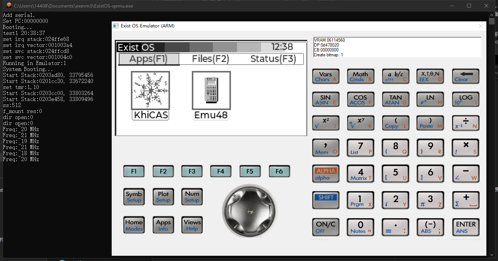
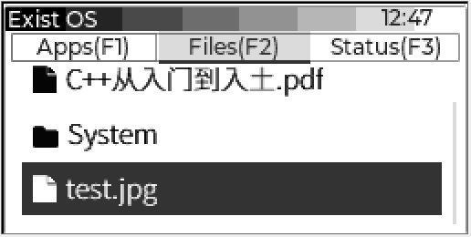

# [ExistOS-For-HP39GII](https://github.com/Repeerc/LibreCalc-For-HP39GII)

[English readme](./README_en.md)

一个开源的 HP39GII 固件项目

## 简介

[](https://opensource.org/licenses/GPL-3.0/)
[](../../actions/workflows/build.yml)

本固件项目由一群计算器爱好者始创，使用了 [FreeRTOS kernel](https://github.com/FreeRTOS/FreeRTOS)、[TinyUSB](https://github.com/hathach/tinyusb)、[FatFs](http://elm-chan.org/fsw/ff/00index_e.html)、[dhara](https://github.com/dlbeer/dhara)、[giac](http://www-fourier.ujf-grenoble.fr/~parisse/giac.html) 等库。我们非常欢迎同好试用和改善本项目的代码，也非常乐意听取您的宝贵意见。期待您的参与！

参见[仅安装](#仅安装)节以获取安装教程。

## 目录

| | 使用者指引 | |
| :---: | :---: | :---: |
| [目前工作进展](#目前工作进展) | | [实验性功能](#实验性功能) |
| | **[安装教程](#仅安装)** | |
| 适用 Win10/11 | [使用 ExistOS Updater 安装](#windows-下使用-existos-updater-刷入) | (推荐新手使用) |
| Win/Linux 通用 | [使用 OS_Loader 和 EDB 安装](#通用方法) | |
| Windows | [模拟器使用](#模拟器使用) | (可体验 ExistOS) |
| | **[使用教程](#固件基本使用)** | |
| [初始化](#初次使用) | [系统快捷键](#系统快捷键) | [访问内部存储](#内部存储的访问) |
| **[KhiCAS 基本使用](#khicas-的基本使用)** | [基本计算](#基本计算) | [示例 1: 绘图](#示例1-绘图) |
| | [示例 2: 不定积分](#示例2-不定积分) | [示例 3: 定积分](#示例3-定积分) |
| | [示例 4: 编程绘制 Logistic 方程映射 Feigenbaum 分岔图](#示例4-编程绘制-logistic-方程映射-feigenbaum-分岔图) | |
| **[实验性功能](#实验性功能说明)** | [充电功能（未完全测试）](#充电功能未完全测试) | [Emu48 39/48 Saturn 模拟器](#emu48-3948-saturn模拟器) |
| **[如何卸载并刷回原生系统](#系统卸载并刷回原生系统)** | **[本项目贡献者](#贡献者)** | **[开源许可证](#许可协议)** |

| | 开发者指引 | |
| :---: | :---: | :---: |
| [目前工作进展](#目前工作进展) | | [实验性功能](#实验性功能) |
| | **[编译与安装教程](#编译和安装)** | |
| [准备环境](#准备环境) | [编译系统](#编译系统) | [固件安装](#固件安装) |
| | **贡献代码** | |
| 文档 (待补) | [第三方 APP 开发](#第三方app开发) | [代码提交规范](#代码提交规范) |
| **[如何卸载并刷回原生系统](#系统卸载并刷回原生系统)** | **[本项目贡献者](#贡献者)** | **[开源许可证](#许可协议)** |

## 目前工作进展

- [x] Boot
- [x] 调试串口
- [x] LCD 256 级灰度 屏幕驱动
- [x] STMP3770 中断控制器
- [x] 键盘驱动（GPIO 轮询）
- [x] 定时器驱动
- [x] CPU 频率设定
- [x] RTC 时钟
- [x] USB 大容量存储模式
- [x] USB 串口控制台
- [x] USB 模拟键盘鼠标
- [x] USB 功能动态配置
- [x] FLASH 驱动
- [x] FATFS 文件系统
- [x] 多任务
- [x] 虚拟内存
- [x] APP 加载
- [x] 最小化 MicroPython 实现
- [x] 用户界面 GUI
- [x] 基本电源管理
- [ ] 完全电源管理
- [x] 完全脱离官方刷机工具的固件升级

### 实验性功能

- [x] USB 输入镍氢电池充电功能
- [x] Saturn 模拟器运行 hp39g 固件
- [ ] Saturn 模拟器运行 hp48g 固件

目前工作进展：如上。关于具体用户界面 GUI 等还在讨论中，如有宝贵意见可于 Issues 提出。

## 仅安装

### Windows 下使用 ExistOS Updater 刷入

您需要准备好：

- 固件：从[此处](https://github.com/ExistOS-Team/ExistOS-For-HP39GII/releases)下载
  - 请下载 `OSLoader.sb` 和 `ExistOS.sys`
- 刷机工具：从[此处](https://github.com/ExistOS-Team/ExistOS_Updater_v2/releases)下载
  - 仅支持 Windows 10，Windows 11

然后参考[此教程](https://github.com/ExistOS-Team/ExistOS_Updater_v2#readme)刷入固件。

### 通用方法

您需要准备好：

- 固件：从[此处](https://github.com/ExistOS-Team/ExistOS-For-HP39GII/releases)下载
  - 请下载 `OSLoader.sb` 和 `ExistOS.sys`
- sb_loader：用于将 OSLoader 载入计算器 RAM，若您的 HP39gii 上没有安装 ExistOS 则需要使用。
  - Windows 用户请从[此处](../../raw/master/tools/sbtools_win/sb_loader.exe)下载二进制文件；
  - Linux 用户请从[此处](../../archive/refs/heads/main.zip)下载压缩包并解压，进入 `tools/sbtools/` 目录，用 `make` 编译（无需安装）。
    - 您会得到 `sb_loader` 可执行文件。
- EDB（Exist Debug Bridge）：用于刷写固件。
  - Windows 用户请从[此处](../../raw/master/tools/edb.exe)下载二进制文件；
  - Linux 用户请从[此处](https://github.com/ExistOS-Team/edb-unix/archive/refs/heads/master.zip)下载压缩包并解压，使用如下命令编译：
    - `mkdir build`
    - `cmake -B build`
    - `cmake --build build`
    - 您会得到 `edb` 可执行文件。

请将上述文件置于同一文件夹下，以便操作。

若您的 HP39gii 上没有安装 ExistOS，请先：
1. 卸下计算器的所有电池
2. 按住 `ON/C` 并连接 USB 到电脑
3. 运行 `sbloader -f OSLoader.sb`
  - 计算器将会启动 ExistOS 引导程序，然后将提示找不到系统（如下图），请不要断开计算器电源（USB），继续下面的步骤。
  - 

当计算器上已有安装 ExistOS 时：
1. 连接 USB 到电脑
2. 运行 `edb -r -s -f OSLoader.sb b`
  - 计算器将重新启动，此步骤会刷入 `OSLoader` 引导程序
3. 运行 `edb -r -s -f ExistOS.sys`
  - 计算器将重新启动，此步骤会刷入 `ExistOS` 主系统
4. 享受 ExistOS 吧
  - 如果遇到问题，或者有意参与本项目，您可以加入 QQ 群（942419621）。

## 编译和安装

### 准备环境

请先克隆本仓库到本地：
```bash
git clone https://github.com/ExistOS-Team/ExistOS-For-HP39GII.git # https
git clone git@github.com:ExistOS-Team/ExistOS-For-HP39GII.git # ssh
```
然后进入目录：
```bash
cd ExistOS-For-HP39GII
```
以下步骤默认假设您已位于本项目根目录。

请注意：
- `gcc-arm-none-eabi` v10.3 测试通过，从[此处](https://developer.arm.com/-/media/Files/downloads/gnu-rm/10.3-2021.10/gcc-arm-none-eabi-10.3-2021.10-x86_64-linux.tar.bz2)可获取适用 Linux 的二进制文件
  - 使用其它版本可能导致 OSLoader 编译后无法运行

|系统|安装|
|----|----|
|Windows|从[这里](https://developer.arm.com/-/media/Files/downloads/gnu-rm/10.3-2021.10/gcc-arm-none-eabi-10.3-2021.10-win32.exe?rev=29bb46cfa0434fbda93abb33c1d480e6&hash=B2C5AAE07841929A0D0BF460896D6E52)下载安装 `gcc-arm-none-eabi`|
| |请勿忘记添加 PATH|
|Debian|`apt-get install gcc-arm-none-eabi`|
|Ubuntu|`apt-get install gcc-arm-none-eabi`|
|Arch Linux|`pacman -Syu arm-none-eabi-gcc`|
|其它|查阅是否有提供二进制包，或者从[源码](https://developer.arm.com/tools-and-software/open-source-software/developer-tools/gnu-toolchain/downloads)编译|
| | 上方链接系新版本，[旧版本（v10.3）见此](https://developer.arm.com/downloads/-/gnu-rm#panel1a)|

添加 udev 规则：
|系统|安装|
|----|----|
|Windows|不需要执行此步骤|
|Linux（大多数发行版）|`sudo cp 99-hp39gii.rules /etc/udev/rules.d/`|
||然后重启 `udev` 以载入规则：|
||`sudo service udev restart`|
||如果上面的命令不起作用：|
||`sudo udevadm control --reload-rules`|
||`sudo udevadm trigger`|
|其它使用 udev 的系统|拷贝项目下的 `99-hp39gii.rules` 到 udev 规则目录，随后重启 udev|

安装编译器：
|系统|安装|
|----|----|
|Windows|下载 [Ninja](https://github.com/ninja-build/ninja/releases)，解压，然后将解压目录添加到 PATH 中|
|Debian|`apt-get install cmake make`|
|Ubuntu|`apt-get install cmake make`|
|Arch Linux|`pacman -Syu cmake make`|

安装依赖库：
|系统|安装|
|----|----|
|Windows|已经预先编译好，无需安装|
|Debian|`apt-get install libcrypto++-dev libusb-1.0-0-dev`|
|Ubuntu|`apt-get install libcrypto++6 libcrypto++-dev libusb-1.0.0-dev`|
|Arch Linux|`pacman -Syu libusb crypto++`|
|其它|安装 libusb 1.0，[libcrypto++](https://cryptopp.com/wiki/Linux#Distribution_Package)，随后用 `pkg-config` 检查是否已经正确应用|

_Tips：`pkg-config` 会根据 `/usr/lib/pkgconfig/` 中存放的 `*.pc`文件定位库位置，如果您手动添加依赖库，请修改`CMakeLists.txt` 更正依赖库路径。_

编译 sbtool：
|系统|安装|
|----|----|
|Windows|已经预先编译好，在 `tools` 目录下|
|Linux|`cd tools/sbtools/ && make`|
||`cp sb_loader ../`|
||`cp elftosb ../`|
||`cd ../../`|
||`cd Libs/src/micropython-master/ports/eoslib/ && make`|
||`cd ../../../../../`|

编译 EDB：
|系统|安装|
|----|----|
|Windows|已经预先编译好，在 `tools` 目录下|
|Linux|`cd tools/`|
||`git clone https://github.com/ExistOS-Team/edb-unix.git`|
||`cd edb-unix/`|
||`mkdir build`|
||`cmake -B build/`|
||`cmake --build build/`|
||`cp build/edb ../`|
||`cd ../../`|

### 编译系统

新建一个文件夹用于存放编译的二进制文件和缓存：

```bash
mkdir build
cd build
```

准备编译：  
|系统|安装|备注|
|----|----|----|
|Windows|`cmake .. -G Ninja`|指定了 Ninja 作为编译器|
|Linux|`cmake ..`||

编译：  
|系统|安装|
|----|----|
|Windows|`ninja`|
|Linux|`make`|

### 固件安装

#### OSLoader（RAM）

注意：HP39GII 的相关驱动程序请自行安装。

提示：已安装 ExistOS 的计算器不需要执行此步骤，除非，刷坏了……

OSLoader 是引导程序，用于加载 ExistOS 并提供底层 API 和虚拟内存相关功能，使用下面的命令刷入 OSLoader（需要计算器处在刷写模式）。

要刷写 OSLoader，需要先将计算器完全断电（卸下所有电池），按住 `ON/C` 键不放，之后插入 USB 数据线。

Windows 系统下可以查看设备管理器是否出现一个名为 “USB 输入设备” 且 ID 为 066F:3770 的 USB HID 设备


|系统|安装|
|----|----|
|Windows|`ninja sb_flash`|
|Linux|`make sb_flash`|

#### OSLoader

|系统|安装|
|----|----|
|Windows|`ninja edb_flash_loader`|
|Linux|`make edb_flash_loader`|

刷入 OSLoader 后计算器会自动重启，此时已刷入新的 OSLoader。

#### ExistOS

|系统|安装|
|----|----|
|Windows|`ninja edb_flash_sys`|
|Linux|`make edb_flash_sys`|

刷入 ExistOS 后计算器会自动重启，此时已刷入新的系统并可以使用。

## 模拟器使用

可以通过 Windows 平台上的 ExistOS Emulator 模拟器体验系统。



模拟器下载地址：https://github.com/ExistOS-Team/ExistOS-Emulator/releases/tag/Latest

### 模拟器文件传输

在模拟器进入系统主界面后直接将 PC 上的文件拖入模拟器窗口后即可完成文件发送。

### 模拟器系统更新

直接替换 ExistOS.sys。

## 固件基本使用

### 初次使用

系统编译和安装完成后，第一次开机将会见到如下系统界面，提示将 Flash 的数据区格式化为 FAT16 格式的文件系统，`ENTER` 点击 OK 开始格式化，大约耗时半分钟。


出现以下界面后表示 Flash 数据区已经格式化完毕，点击 OK 进入系统主界面。


目前系统预置应用如下，KhiCAS 用于进行代数计算，Emu48 目前为实验应用，用于模拟 hp39g/48g 系计算器系统（目前实现了对 39g 的基本模拟），将固件文件放入计算器后即可启动，[←][→][↑][↓]键选择，[ENTER]键确定，F1~F3 切换选项卡。


Files 选项卡为当前文件浏览器，可以浏览目录、打开 jpg 格式图片、播放 mjpeg 编码 avi 格式视频以及执行.exp 格式的 Exist APP 应用，目前暂未实现其它文件管理功能。



Status 选项卡用于显示当前系统状态，以及相关的参数设定。


### 系统快捷键

以下快捷键在任何界面均可起作用（包括系统崩溃时）

```
  ON + F5 清除资料，格式化，重启菜单
  ON + [+] 增加屏幕对比度
  ON + [-] 减少屏幕对比度
```

### 内部存储的访问

在系统开机前（或按下 `ON/C` 开机之后立即）按住 `F2` 键不放，会出现如下界面：


屏幕出现 USB MSC Mode 字符后使用 USB 线缆接入计算机即可访问存储空间，此时电脑上会出现一个约 80MB 的 U 盘，System 为系统资源（字体、图片之类，目前暂不使用），xcas 文件夹存放 KhiCAS 的用户脚本、会话(历史记录)等资料。操作完文件后务必使用安全弹出防止文件损坏，安全弹出时计算器会对写入 Flash 内容进行同步和整理，可能会出现短暂的卡顿，请耐心等待。


### KhiCAS 的基本使用

主界面 Application 选项卡中按下 `↓` 键选中 `KhiCAS` 应用，按下 `Enter` 键启动应用。第一次启动时会弹出提示选择使用 Xcas 语法模式 `F1` 还是 Python 语法模式 `F6`。


设定完成后当前状态会显示在下边的状态栏，其中第一项为当前时间，第二项为语法模式（Xcas 或 Python），第三项弧度或角度制，第四项为当前会话文件名。

使用 time(hh,mm) 命令设置时间(24 时计时)，例如 time(11,45) 表示设置时间为 11:45


初始化完成后便可以进行一些相关的计算。

[ON/C]清除历史记录。

[SHIFT]+[ON/C]保存会话并退出。

#### 基本计算

在 KhiCAS 中可以输入一般的表达式进行计算，支持大整数计算，但对于小数仅支持单精度浮点。


对于输入的表达式（或 `↑` `↓` 键选择的历史记录）可以按下 View 键 `F3` 后将其转化为自然输入模式进行编辑。


使用 `F1` 和 `F2` 键可以调出可能常用的指令菜单。


`cmds` 菜单 (`F4`) 里用二级目录的方式列出了 KhiCAS 中的全部命令（包括代数、复数、多项式、概率、绘图等命令），可以在其中搜寻需要的指令，选中对应的指令后 `input` 键输入到主界面，或按下 `help` 查看指令帮助，`ex1`、`ex2` 键输入自带的示例。


#### 示例 1: 绘图

使用 `plot` 命令可以对基本函数进行绘图，绘图界面 `↑` `↓` `←` `→` 键移动画布，`+` `-` 键缩放，`*` 键自动缩放铺满屏幕，`/` 键自动缩放让 x y 坐标刻度等距。

```
  plot(表达式, x)
  plot(表达式, x=[起点...终点], xstep=步进)
```


`plotpolar` 命令则在极坐标系下绘图


`plotfield` 绘制矢量场


#### 示例 2: 不定积分


#### 示例 3: 定积分


#### 示例 4: 编程绘制 Logistic 方程映射 Feigenbaum 分岔图

在 KhiCAS 中有两种语法工作模式 Xcas 和 Python，并提供了脚本执行功能，因此可以通过编程的方式定义新函数，这里使用 Python 语法来实现绘制如下的分岔图。


在主界面中按下 File 键 (`F6`)，选择第六项打开脚本编辑器。


脚本编辑器中，左上角显示当前时间，语法模式，文件名，当前编辑行号/总行数。
`F1`~`F3`中存储了一些如符号判断、循环体、函数定义等的快捷命令


这里使用的脚本如下，首先先定义了两个全局向量 `r` 和 `p` ，函数 `f` 迭代的结果会存储在这两个向量中，最后在外部能够调用 KhiCAS 的 `point(r,p)` 命令进行绘图。

```python
r = []
p = []
def f():
  for u in range(0, 40):
    x = 0.132456
    for n in range(1,50):
      x1 = (u/10)*x*(1-x)
      x = x1
      if n > 25:
        r.append(u/100)
        p.append(x)
  return
```

编辑完成后使用 File 菜单里的 Check syntax 选项可以对脚本进行检查和编译，结果会输出到主控制台上。


如下图为脚本有符号错误时编译的结果，会具体提示所在行号（或者是在 Xcas 模式下编译 Python 脚本也会出现错误）


编译成功的结果如下图。


随后调用脚本中的函数名执行上面所写的函数，执行完后再调用 point 指令将迭代输出的散点绘制到画布上。


最终输出：


## 实验性功能说明

### 充电功能（未完全测试）

目前固件支持通过控制 SoC 内部 DCDC 和线性稳压器从 USB 取电，降压到 1.4V 后输出给电池仓进行充电，因此使用该功能时务必使用可充电电池，以防发生危险。

使用方法：接入 USB 线后切换到`Status`界面，滚动至最底部勾选`Enable Charge`后电池仓开始输出电流，查看上面显示信息可以看到核心温度上升至 50℃ 左右，这是因为充电相关的升降压电路是和 CPU 集成在同一芯片内。


以下是使用一节标称 400mAh 1.2V AAAA 电池测试充电时绘制的系统状况曲线（充电时间：6 小时）：


以下是使用一节标称 400mAh 1.2V AAAA 电池测试放电时绘制的系统状况曲线（放电时间：2 小时）：


### Emu48 39/48 Saturn 模拟器

该功能可以通过运行 Saturn 虚拟机的方式运行 HP39/48 系列计算器的固件，目前仅完成了 hp 39g 固件的加载，退出和数据保存功能还未完成，且未进行相关优化，速度较慢。

使用方法：将 HP 39g 计算器的固件 rom.g39 (1MB) 放置到计算器存储空间的根目录下，在系统应用主界面点击 Emu48 后即可使用，故载入速度较慢，请耐心等待。

重启：`ON + F6`

关机：`ON + F3`


## 系统卸载并刷回原生系统

刷入原生系统前需要将全片 Flash 擦除，否则使用原生刷机工具时会卡在格式化环节。

Flash 全盘擦除方法：在刷入 OS Loader 后或 Exist OS 系统运行时，按下`ON`+`F5`界面进入数据清空界面，随后选择全盘格式化，请注意，全盘数据擦除操作不可撤销，当显示“Operation Finish.”后操作完成，Flash 数据将全部清除且不可恢复，此时重新上电计算器并在 Win7/XP 环境下使用原生刷机工具即可刷入。

## 第三方 APP 开发

ExistOS APP 开发见如下仓库：

https://github.com/ExistOS-Team/ExistOS-App-demo

## 代码提交规范

**如果您想贡献代码，请遵守以下规范**

1. 变量

   - 变量采用小驼峰命名法命名。例如 `windowHeight`。
   - 函数参数的命名与变量相同。
   - 不应使用单个字符命名。临时变量，循环变量除外，允许使用 i，j，k 等。
   - 可考虑在名称前加适当有意义的前缀，如 p 代表指针。
   - 不得在一行内同时定义变量和指针，如 `char *p, q;`。

2. 函数

   - 函数采用下划线命名法命名。例如 `get_window_width`。
   - 函数的命名应遵循动宾关系。
   - 可考虑在名称前加适当有意义的前缀，如 is 代表返回值为 bool 类型。
   - 短小的函数可以定义为 inline，函数的参数和返回值应尽量使用指针而非变量。
   - 应尽量避免使用递归，而应考虑重构为循环。

3. 常量，宏及硬件相关

   - 常量及宏采用下划线分隔大写字母的方式命名。例如 `MAX_WIDTH`。

4. 自定义类型

   - 自定义类型采用下划线命名法命名（暂定）。
   - 用 struct 定义非单例对象时，必须使用 typedef 语句先定义自定义类型。

5. 运算符及其他符号

   - 一元运算符应紧贴变量，如 `c++`，`*p`。
   - 二元运算符两侧都应空格，如 `i == 1`，`a += 3`。例外：->运算符。
   - 三元运算符同二元运算符，如 `isLeft ? 1 : 0`。
   - 逗号后应空格。
   - 在不易理解的地方应适当加注括号。

6. 伪类

   若确有面向对象的必要的，可以考虑用 `typedef struct` 实现伪类。

   - 伪类采用大驼峰（帕斯卡）命名法命名。

   - 伪类中保存属性，其命名与一般变量相同。

   - 伪类的方法不保存在伪类中，而采用全局函数。方法采用下划线法命名。

     - 一般方法命名为 `ClassName_method_name`，其第一个参数始终应为一个指向该类型对象的指针并命名为 `this`（即使不需要）。

     - 静态方法命名为 `ClassName_static_method_name`。
     - 命名为 `ClassName_initializer` 的一般方法应在伪类的对象定义后立即调用。

7. 代码部分

   7.1

   ```c
   if (a == 1) {                          // 关键字与括号间应空格，括号与花括号间应空格
       // code here
   }else{                                 // 采用Java风格
       // code here
   }
   if (b == 1) return;                    // 块中只有一句代码时，可以不打花括号并不换行，空一格即可
   ```

   7.2

   ```c
   while (true)
       ;                                  // 使用空循环时，应将分号换行并缩进
   ```

   7.3

   ​ (a) 一般 for 循环的循环变量定义在 for 循环中：

   ```c
       for (int i = 0; i < l; i++) {
           // code here
       }
   ```

   ​ (b) 外部使用循环变量的情况，也应在此处赋初值：

   ```c
       int i;
       for (i = 0; i < l; i++) {
               // code here
       }
       return i;
   ```

   ​ (c) 非必要不得将 for 循环此三处中任意一处空出：`for ( ; ; )`，否则请使用 while 循环。

   7.4 禁止在需要判断语句的地方进行赋值操作，如 `if (a = 1)，(a = 1) ? a : 0` 等。

   7.5 非必要应尽量避免使用 goto 语句。

   7.6 应多用 switch，少用 else if。switch 语句中，每一个 case 中都最好有一个 break/return 语句，多个 case 共用完全相同的一段代码时除外。使用 switch 穿越时应分外小心并最好加注注释。

对于 VSCode 用户，可以使用 clang-format 扩展方便的格式化代码。

## 贡献者

<a href = "https://github.com/ExistOS-Team/ExistOS-For-HP39GII/graphs/contributors">
  
</a>

## 许可协议

[GPL-3.0](../../blob/master/LICENSE)
