# [ExistOS-For-HP39GII](https://github.com/Repeerc/LibreCalc-For-HP39GII)

[English readme](./README_en.md)

一个开源的HP39GII固件项目

## 简介

[](https://opensource.org/licenses/GPL-3.0/)
[](https://github.com/ExistOS-Team/ExistOS-For-HP39GII/actions/workflows/build.yml)

本固件项目由一群计算器爱好者始创，使用了[FreeRTOS kernel](https://github.com/FreeRTOS/FreeRTOS)、[TinyUSB](https://github.com/hathach/tinyusb)、[FatFs](http://elm-chan.org/fsw/ff/00index_e.html)、[dhara](https://github.com/dlbeer/dhara)、[giac](http://www-fourier.ujf-grenoble.fr/~parisse/giac.html)等库。我们非常欢迎同好试用和改善本项目的代码，也非常乐意听取您的宝贵意见。期待您的参与！
## 目前工作进展
- [x] Boot
- [x] 调试串口
- [x] LCD 256级灰度 屏幕驱动
- [x] STMP3770中断控制器
- [x] 键盘驱动（GPIO轮询）
- [x] 定时器驱动
- [x] CPU频率设定
- [ ] RTC时钟
- [x] USB大容量存储模式
- [ ] USB串口控制台
- [ ] USB模拟键盘鼠标
- [x] USB功能动态配置
- [x] FLASH驱动
- [x] FATFS文件系统
- [ ] 多任务
- [x] 虚拟内存
- [ ] ~~进程、ELF加载~~
- [ ] 最小化MicroPython实现
- [ ] ~~进程切换、进程结束、ELF卸载~~
- [x] 用户界面GUI
- [ ] 电源管理
- [ ] ~~Linux 5.4 半虚拟化双内核实现~~
- [ ] 完全脱离官方刷机工具的固件升级

目前工作进展：已经完成了操作系统大部分内核和一些必要的硬件驱动。但由于未弄清STMP3770固件刷入机制，因此需要在Win7\WinXP环境下用计算器官方的固件升级软件刷入本固件。同时还没有用户界面，现在的工作重心是实现虚拟内存管理和进程加载。关于用户界面GUI等还在讨论中，如有宝贵意见可于Issues提出。


## 固件编译

### 准备

需要安装 `gcc-arm-none-eabi`：  
- 对于 Windows 系统，请从[这里](https://developer.arm.com/downloads/-/gnu-rm)下载和安装。
  - 注意：需要将安装目录下的 `bin` 路径添加到 PATH 中
- 对于 Linux 系统，不同的发行版可能略有差异
  - Debian/Ubuntu 等使用 apt 包管理器的发行版请安装
    ```bash
    sudo apt-get install gcc-arm-none-eabi -y
    ```
  - Arch 等使用 pacman 包管理器的发行版请安装
    ```bash
    sudo pacman -Syu arm-none-eabi-gcc
    ```
- 对于其它系统，或者没有提供相应包的 Linux 发行版
  - 从[这里](https://developer.arm.com/tools-and-software/open-source-software/developer-tools/gnu-toolchain/downloads)下载源代码编译安装

#### Windows

请下载 [Ninja](https://github.com/ninja-build/ninja/releases)，解压到任意目录下，然后将该目录添加到 PATH 中。

#### Linux

##### 添加 udev 规则

对于 Linux 系统，为了让 udev 识别 HP39GII，需要将本项目根目录下的 `99-hp39gii.rules` 复制到 `/etc/udev/rules.d/`：  
```bash
sudo cp 99-hp39gii.rules /etc/udev/rules.d/
```

然后重启 `udev` 以载入规则：  
```bash
sudo service udev restart
```
如果上面的命令不起作用：  
```bash
sudo udevadm control --reload-rules
sudo udevadm trigger
```

##### 编译 sbtool

本项目为 Windows 预先编译好了相应文件，但是 Linux 下需要手动编译。

进入项目目录 `tools/sbtools` 并 `make` 编译（无需安装），可能需要安装以下库：  
- libusb（1.0）
- libcrypto++
  - 安装教程见于 [Crypto++ Wiki](https://cryptopp.com/wiki/Linux#Distribution_Package)

- Ubuntu 发行版请参考本项目的 Action 文件安装相应库
  ```bash
  sudo apt-get install libcrypto++6 libcrypto++-dev libusb-1.0-0-dev -y
  ```
- Arch 请安装以下库
  ```bash
  sudo pacman -Syu libusb crypto++
  ````

若 `pkg-config` 提示找不到 libcrypto++ 或其它库，请检查是否安装了相应库，确认 `/usr/lib/pkgconfig/` 下是否有对于库的的 `.pc` 文件，这是使 pkg-config 识别它所需要的。  
若有，请手动修改 Makefile。
若无，可能需要重新安装相应库，或手动修改 Makefile 中的 pkg-config 命令。

然后进入 `Libs/src/micropython-master/ports/eoslib` 目录并 `make`：  
```bash
cd Libs/src/micropython-master/ports/eoslib
make
```

### 编译

新建一个文件夹用于存放编译的二进制文件和缓存：  
```bash
mkdir build
cd build
```

准备编译：  
```bash
cmake ..
```
Windows 请用以下命令指定用 Ninja 作为编译器：  
```bash
cmake .. -G Ninja
```

编译：  
```bash
make
```
Windows 请用 Ninja：  
```bash
ninja
```

## 固件安装

### 刷入 OS Loader

注意：HP39GII的相关驱动程序请自行安装。

OS Loader 是引导程序，用于加载 ExistOS 并提供底层 API 和虚拟内存相关功能，使用下面的命令刷入 OL（需要计算器处在刷写模式）。

要刷写OS Loader，需要先将计算器完全断电（卸下所有电池），按住 `ON/C` 键并同时插入 USB 数据线。

```bash
make flash
```
Windows 请用 Ninja：  
```bash
ninja flash
```

如无法使用上述命令刷入 OL，尝试安装 HP39GII 官方工具然后使用其 Firmware Updater 刷入 OL（用编译的 `firmware.sb` 替换官方固件 `firmware.sb`，确保文件名相同）。

也可使用 [ExistOS Updater](https://github.com/ExistOS-Team/ExistOS-Updater/releases)（可在 Windows 10 或更新的版本上使用）刷入 OL。

### 安装 Exist OS

OL 刷入后，引导程序会开始执行，此时计算器应显示如下界面，若之前已经刷写并安装过Exist OS系统，则可能不会出现该配置界面，只需要正常开机并按住`Clear`(退格)键即可进入该配置界面。

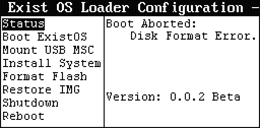

由于本固件的底层驱动以及闪存的存储结构与原始固件不同，因此在这里会提示磁盘格式错误，因此需要对闪存进行低级格式化之后才可继续安装固件。（注意，接下来的操作将会抹除掉计算器上的所有数据，请先备份好相关文件）


使用方向键将进入`Format Flash`菜单，该菜单下有两个选项，`Erase`选项仅会将Flash全片擦除，之后不会写入任何数据，该选项主要用于恢复官方的系统镜像。
为了安装新固件，需要进行分区并格式化，故此处选中`Format`选项之后，按下`Enter`键，将开始执行格式化操作，该过程需要1~2分钟。

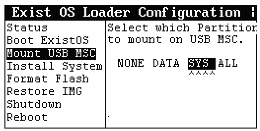

闪存格式化完成之后，将菜单切换至`Mount USB MSC`界面，通过这个界面可以将计算器刚刚分区并格式化完成后的分区挂载到USB上，以便用电脑直接操作内部Flash并拷贝系统。
在这里选中`SYS`并按下`Enter`键挂载计算器的系统分区。

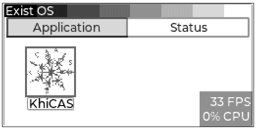

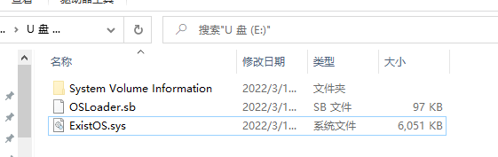

挂载`SYS`分区之后，电脑上会多出一个10MB左右的U盘，接着将刚刚编译出的`OSLoader.sb`引导文件和`ExistOS.sys`系统文件拷贝至计算器中。拷贝完成后安全弹出U盘，或者在计算器上将挂载选项设置为`None`

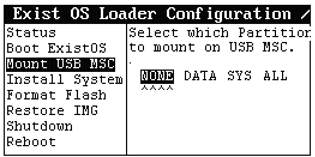

（弹出磁盘或卸载磁盘之后的某些情况下计算器界面可能会卡住1分钟左右，不用担心，请坐和放宽，此时引导程序正在对磁盘执行Trim操作进行垃圾回收，以加快往后系统运行时的IO速度）

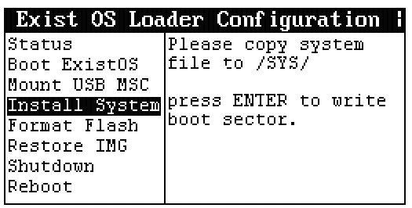

接下来将菜单移动至`Install System`选项，并按下`ENTER`键，引导程序会将自己写入到计算器的引导扇区中以完成最后的安装。

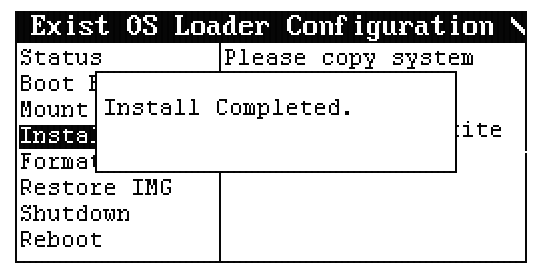

出现以上界面时表示系统已经安装完成，此时可以选中`Boot ExistOS`直接引导或`Reboot`重启进入系统。

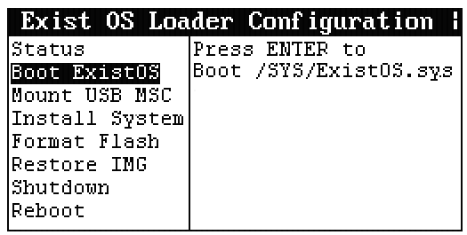

## 固件基本使用

系统编译和安装完成后，开机将会见到如下系统界面（默认开启4MB虚拟内存）。


目前的版本中设置了两个输入界面，按下`F1`进入系统自带的Shell，可以执行系统控制相关的命令（目前暂无）。按下`F2`将切换至CAS计算模式，进入CAS模式之前系统会对giac运行环境进行初始化，需要几秒钟的时间。


初始化完成后便可以进行一些相关的计算。

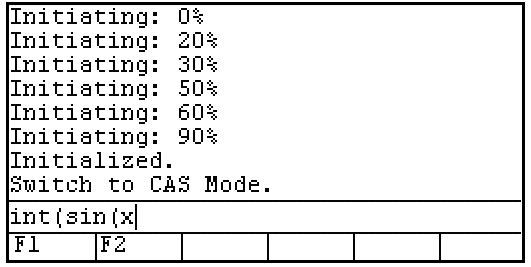

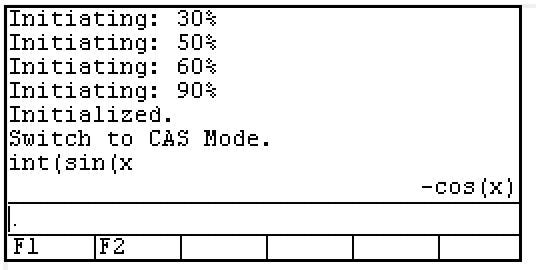


计算的结果会保存在上方的历史记录框内，可以通过上下光标键进行选择，选择需要的表达式按下COPY(`F4`)键可将该表达式复制到输入框中，并可对其进行修改作为下一次计算的输入。

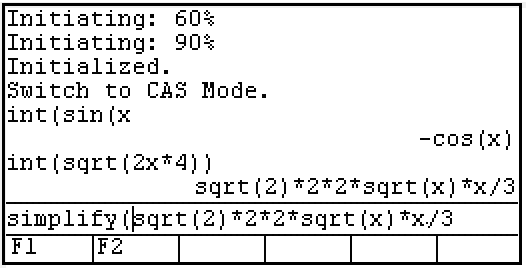


计算过程中可按下`ON`键中断正在计算的表达式。

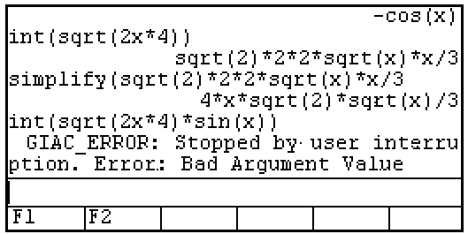

由于使用的giac代数运算系统体积相对来说较为庞大(约6MB)，而该计算器仅有500KB左右的运行内存，因此在进行计算时需要频繁的IO操作，从而导致其在某些复杂问题求解时会出现计算十分缓慢的问题。

## 代码提交规范

**如果您想贡献代码，请遵守以下规范**

1. 变量

    * 变量采用小驼峰命名法命名。例如`windowHeight`。
    * 函数参数的命名与变量相同。
    * 不应使用单个字符命名。临时变量，循环变量除外，允许使用i，j，k等。
    * 可考虑在名称前加适当有意义的前缀，如p代表指针。
    * 不得在一行内同时定义变量和指针，如 `char *p, q;`。

2. 函数

    * 函数采用下划线命名法命名。例如`get_window_width`。
    * 函数的命名应遵循动宾关系。
    * 可考虑在名称前加适当有意义的前缀，如is代表返回值为bool类型。
    * 短小的函数可以定义为inline，函数的参数和返回值应尽量使用指针而非变量。
    * 应尽量避免使用递归，而应考虑重构为循环。

3. 常量，宏及硬件相关

    * 常量及宏采用下划线分隔大写字母的方式命名。例如`MAX_WIDTH`。

4. 自定义类型

    * 自定义类型采用下划线命名法命名（暂定）。
    * 用struct定义非单例对象时，必须使用typedef语句先定义自定义类型。

5. 运算符及其他符号

    * 一元运算符应紧贴变量，如`c++`，`*p`。
    * 二元运算符两侧都应空格，如`i == 1`，`a += 3`。例外：->运算符。
    * 三元运算符同二元运算符，如`isLeft ? 1 : 0`。
    * 逗号后应空格。
    * 在不易理解的地方应适当加注括号。

6. 伪类

    若确有面向对象的必要的，可以考虑用`typedef struct`实现伪类。

    * 伪类采用大驼峰（帕斯卡）命名法命名。

    * 伪类中保存属性，其命名与一般变量相同。

    * 伪类的方法不保存在伪类中，而采用全局函数。方法采用下划线法命名。

      * 一般方法命名为`ClassName_method_name`，其第一个参数始终应为一个指向该类型对象的指针并命名为`this`（即使不需要）。

      * 静态方法命名为`ClassName_static_method_name`。
      * 命名为`ClassName_initializer`的一般方法应在伪类的对象定义后立即调用。

7. 代码部分

    7.1

    ```c
    if (a == 1) {                          // 关键字与括号间应空格，括号与花括号间应空格
        // code here
    }else{                                 // 采用Java风格
        // code here
    }
    if (b == 1) return;                    // 块中只有一句代码时，可以不打花括号并不换行，空一格即可
    ```

    7.2

    ```c
    while (true)
        ;                                  // 使用空循环时，应将分号换行并缩进
    ```
    7.3

    ​	(a) 一般for循环的循环变量定义在for循环中：

    ```c
        for (int i = 0; i < l; i++) {
            // code here
        }
    ```

    ​	(b) 外部使用循环变量的情况，也应在此处赋初值：

    ```c
        int i;
        for (i = 0; i < l; i++) {
                // code here
        }
        return i;
    ```

    ​	(c) 不得将for循环此三处中任意一处空出：` for ( ; ; ) `，否则请使用while循环。

    7.4 禁止在需要判断语句的地方进行赋值操作，如 `if (a = 1)，(a = 1) ? a : 0 `等。

    7.5 应尽量避免使用goto语句。

    7.6 应多用switch，少用else if。switch语句中，每一个case中都最好有一个break/return语句，多个case共用完全相同的一段代码时除外。使用switch穿越时应分外小心并最好加注注释。

对于 VSCode 用户，可以使用 clang-format 扩展方便的格式化代码。

## 贡献者


## 许可协议

[GPL-3.0](https://github.com/Repeerc/LibreCalc-For-HP39GII/blob/master/LICENSE)
