```
=== \ / === /== === for
|   \ /  |  |    |  HP39gii
|--  -   |  \-\  |  /=\ /==
|   / \  |    |  |  | | \-\
=== / \ === ==/  |  \=/ ==/
```

[English readme](./README_en.md)

一个开源的HP39GII固件项目

## 简介

[](https://opensource.org/licenses/GPL-3.0/)
[](../../actions/workflows/build.yml)

本固件项目由一群计算器爱好者始创，使用了[FreeRTOS kernel](https://github.com/FreeRTOS/FreeRTOS)、[TinyUSB](https://github.com/hathach/tinyusb)、[FatFs](http://elm-chan.org/fsw/ff/00index_e.html)、[dhara](https://github.com/dlbeer/dhara)、[giac](http://www-fourier.ujf-grenoble.fr/~parisse/giac.html)等库。我们非常欢迎同好试用和改善本项目的代码，也非常乐意听取您的宝贵意见。期待您的参与！

## 目录

- [ExistOS-For-HP39GII](#existos-for-hp39gii)
  - [简介](#简介)
  - [目录](#目录)
  - [目前工作进展](#目前工作进展)
  - [固件编译](#固件编译)
    - [准备](#准备)
    - [编译系统](#编译系统)
  - [固件安装 （目前仅支持Windows下刷入）](#固件安装-目前仅支持windows下刷入)
    - [刷入 OS Loader](#刷入-os-loader)
      - [手动刷入](#手动刷入)
      - [自动工具刷入](#自动工具刷入)
  - [固件基本使用](#固件基本使用)
    - [初次使用](#初次使用)
    - [内部存储的访问](#内部存储的访问)
    - [KhiCAS的基本使用](#khicas的基本使用)
      - [基本计算](#基本计算)
      - [示例1: 绘图](#示例1-绘图)
      - [示例2: 不定积分](#示例2-不定积分)
      - [示例3: 定积分](#示例3-定积分)
      - [示例4: 编程绘制Logistic方程映射Feigenbaum分岔图](#示例4-编程绘制logistic方程映射feigenbaum分岔图)
  - [系统卸载并刷回原生系统](#系统卸载并刷回原生系统)
  - [代码提交规范](#代码提交规范)
  - [贡献者](#贡献者)
  - [许可协议](#许可协议)


## 目前工作进展
- [x] Boot
- [x] 调试串口
- [x] LCD 256级灰度 屏幕驱动
- [x] STMP3770中断控制器
- [x] 键盘驱动（GPIO轮询）
- [x] 定时器驱动
- [x] CPU频率设定
- [ ] RTC时钟
- [x] USB大容量存储模式
- [x] USB串口控制台
- [x] USB模拟键盘鼠标
- [x] USB功能动态配置
- [x] FLASH驱动
- [x] FATFS文件系统
- [x] 多任务
- [x] 虚拟内存
- [ ] APP加载
- [x] 最小化MicroPython实现
- [x] 用户界面GUI
- [x] 基本电源管理
- [ ] 完全电源管理
- [x] 完全脱离官方刷机工具的固件升级

### 实验性功能

- [x] 通过USB口输入给电池仓镍氢电池充电


目前工作进展：如上。关于具体用户界面GUI等还在讨论中，如有宝贵意见可于Issues提出。


## 固件编译

- 如果您只想快捷地安装本系统而非自行编译，请自行下载[Release](../../releases)中的固件并直接跳至 `固件安装` 章节的 [自动工具刷入](#自动工具刷入) 部分。
  - 请注意发行版前的 `pre-release` 标志，它表示该版本可能不稳定或有问题，如果您刷入 `pre-release` 版本的固件无法启动，请更换其它版本。

### 准备

首先，安装 `gcc-arm-none-eabi`：
|系统|安装|
|----|----|
|Windows|从[这里](https://developer.arm.com/downloads/-/gnu-rm)下载安装 `gcc-arm-none-eabi`|
|Debian|`apt-get install gcc-arm-none-eabi`|
|Ubuntu|`apt-get install gcc-arm-none-eabi`|
|Arch Linux|`pacman -Syu arm-none-eabi-gcc`|
|其它|查阅是否有提供二进制包，或者从[源码](https://developer.arm.com/tools-and-software/open-source-software/developer-tools/gnu-toolchain/downloads)编译|

添加udev规则：
|系统|安装|
|----|----|
|Windows|不需要执行此步骤|
|Linux（大多数发行版）|`sudo cp 99-hp39gii.rules /etc/udev/rules.d/`|
||然后重启 `udev` 以载入规则：|
||`sudo service udev restart`|
||如果上面的命令不起作用：|
||`sudo udevadm control --reload-rules`|
||`sudo udevadm trigger`|
|其它使用udev的系统|拷贝项目下的 `99-hp39gii.rules` 到 udev 规则目录，随后重启udev|

安装编译器：
|系统|安装|
|----|----|
|Windows|下载 [Ninja](https://github.com/ninja-build/ninja/releases)，解压，然后将解压目录添加到 PATH 中|
|Debian|`apt-get install cmake make`|
|Ubuntu|`apt-get install cmake make`|
|Arch Linux|`pacman -Syu cmake make`|

安装依赖库：
|系统|安装|
|----|----|
|Windows|已经预先编译好，无需安装|
|Debian|`apt-get install libcrypto++-dev libusb-1.0-0-dev`|
|Ubuntu|`apt-get install libcrypto++6 libcrypto++-dev libusb-1.0.0-dev`|
|Arch Linux|`pacman -Syu libusb crypto++`|
|其它|安装 libusb 1.0，[libcrypto++](https://cryptopp.com/wiki/Linux#Distribution_Package)，随后用 `pkg-config` 检查是否已经正确应用|

*Tips：`pkg-config` 会根据 `/usr/lib/pkgconfig/` 中存放的 `*.pc` 文件定位库位置，如果您手动添加依赖库，请修改 `CMakeLists.txt` 更正依赖库路径。*

编译 sbtool：
|系统|安装|
|----|----|
|Windows|已经预先编译好，在 `tools` 目录下|
|Linux|`cd tools/sbtools && make`|
||`cd ../../Libs/src/micropython-master/ports/eoslib && make`|

### 编译系统

新建一个文件夹用于存放编译的二进制文件和缓存：  
```bash
mkdir build
cd build
```

准备编译：  
|系统|安装|备注|
|----|----|----|
|Windows|`cmake .. -G Ninja`|指定了Ninja作为编译器|
|Linux|`cmake ..`||

编译：  
|系统|安装|
|----|----|
|Windows|`ninja`|
|Linux|`make`|

## 固件安装 （目前仅支持Windows下刷入）

### 刷入 OS Loader

注意：HP39GII的相关驱动程序请自行安装。

OS Loader 是引导程序，用于加载 ExistOS 并提供底层 API 和虚拟内存相关功能，使用下面的命令刷入 OS Loader（需要计算器处在刷写模式）。

要刷写OS Loader，需要先将计算器完全断电（卸下所有电池），按住 `ON/C` 键不放，之后插入 USB 数据线。

Windows系统下可以查看设备管理器是否出现一个名为“USB输入设备”且ID为066F:3770的USB HID设备


#### 手动刷入

先使用sbtool工具将OS Loader载入RAM并运行
```bash
ninja sb_flash
```
当OS Loader运行后，计算器会显示如下界面提示“找不到系统”：

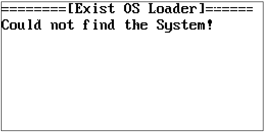

此时OSL仅在内存中运行，接着执行以下将OS Loader刷入计算器的Flash引导区
```bash
ninja edb_flash_loader
```
刷入OS Loader后计算器会自动重启，但仍找不到系统，最后需要执行以下将系统刷入计算器的Flash
```bash
ninja edb_flash_sys
```
刷入完成后系统将会重启并正常运行，若长时间无反应请尝试从头开始刷入。

#### 自动工具刷入

可使用 [ExistOS Updater](https://github.com/ExistOS-Team/ExistOS_Updater_v2/releases)（可在 Windows 10 或更新的版本上使用）刷入 OSLoader和System。

在没有刷入过OSLoader的设备(如安装了官方固件的设备)上，请将计算器完全关机，按住 `ON/C` 键将计算器连接至电脑。单击软件中的 `Refresh` 按钮后，如Status栏显示 `Device Connected [HostLink Mode]` ，便可以选择OSLoader和System镜像，并单击 `Update OSLoader & System` 按钮开始刷写。

在已经刷入了OSLoader的设备上，只需将设备正常开机并连接电脑，单击软件中的 `Refresh` 按钮，在Status栏显示 `Device Connected [Bin Mode EDB]` 后便可进行刷写。

或尝试安装 HP39GII 官方工具然后使用其 Firmware Updater 刷入 OSLoader(将编译的 `OSLoader.sb` 重命名为 `firmware.sb` 并替换官方固件 `firmware.sb`，确保文件名相同)。

## 固件基本使用

### 初次使用

系统编译和安装完成后，第一次开机将会见到如下系统界面，提示将Flash的数据区格式化为FAT16格式的文件系统，[ENTER]点击OK开始格式化，大约耗时半分钟。

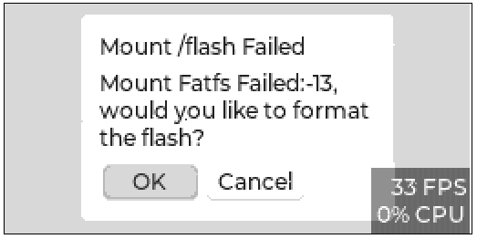

出现以下界面后表示Flash数据区已经格式化完毕，点击OK进入系统主界面。

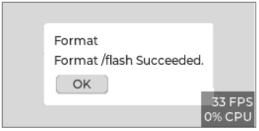

目前系统仅预装了一个KhiCAS应用，[←][→][↑][↓]键选择，[ENTER]键确定/切换

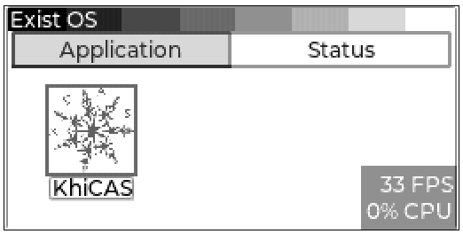

Status选项卡目前仅用于显示当前系统状态。

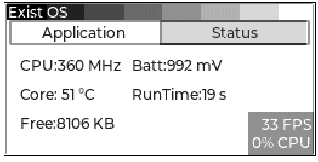

【ON】+【F6】 强制重启
【ON】+【F5】 进入格式化界面

### 内部存储的访问

在系统开机前（或按下ON/C开机之后立即）按住【F2】键不放，会出现如下界面：

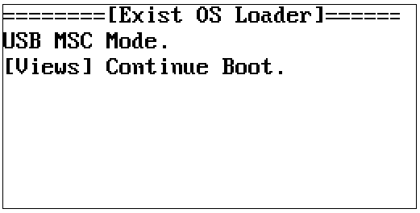

此时电脑上会出现一个约80MB的U盘，即为计算器内部Flash数据区的空间，System为系统资源（字体、图片之类，目前暂不使用），xcas文件夹存放KhiCAS的用户脚本、会话(历史记录)等资料。

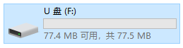

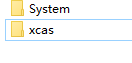

### KhiCAS的基本使用

主界面Application选项卡中按下[↓]键选中KhiCAS应用，按下[Enter]键启动应用。第一次启动时会弹出提示选择使用Xcas语法模式[F1]还是Python语法模式[F6]。

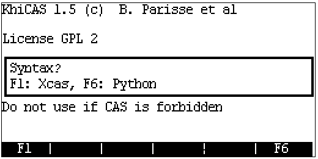

设定完成后下边当前状态会显示在下边的状态栏，其中第一项为当前时间，第二项为语法模式(Xcas或Python)，第三项弧度或角度制，第四项为当前会话文件名。

注：目前RTC函数接口还未适配，故时间显示可能是混乱的。

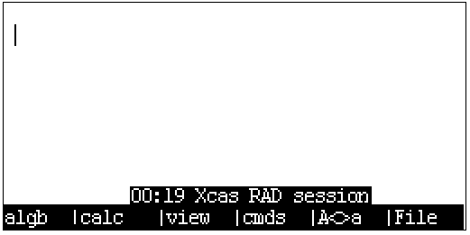

初始化完成后便可以进行一些相关的计算。

长按[ON/C]清除历史记录。

[SHIFT]+长按[ON/C]保存会话并关机。

#### 基本计算
在KhiCAS中可以输入一般的表达式进行计算，支持大整数计算，但对于小数仅支持单精度浮点。

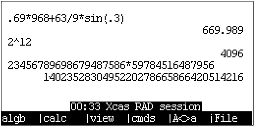

对于输入的表达式（或[↑][↓]键选择的历史记录）可以按下view键[F3]后将其转化为自然输入模式进行编辑。

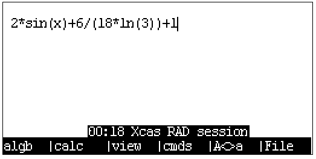


使用[F1]和[F2]键可以调出可能常用的指令菜单。

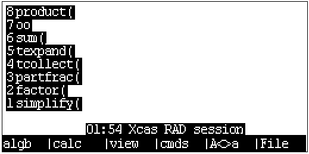

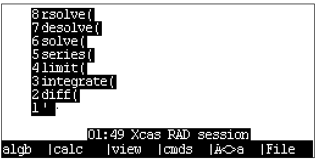

cmds菜单[F4]里用二级目录的方式列出了KhiCAS中的全部命令（包括代数、复数、多项式、概率、绘图等命令），可以在其中搜寻需要的指令，选中对应的指令后input键输入到主界面，或按下help查看指令帮助，ex1、ex2键输入自带的示例。

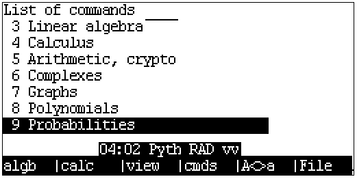


#### 示例1: 绘图
使用plot命令可以对基本函数进行绘图，绘图界面[↑][↓][←][→]键移动画布，[+][-]键缩放，[*]键自动缩放铺满屏幕，[/]键自动缩放让xy坐标刻度等距。

```
  plot(表达式, x)
  plot(表达式, x=[起点...终点], xstep=步进)
```

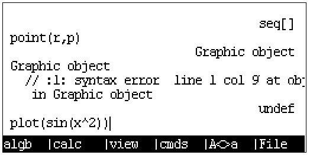


plotpolar命令则在极坐标系下绘图


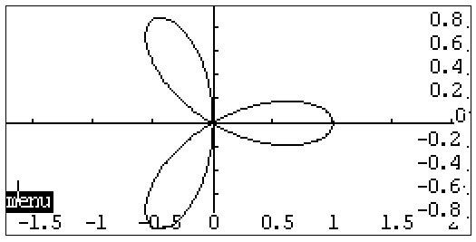

plotfield绘制矢量场

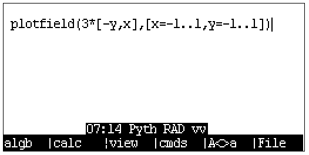

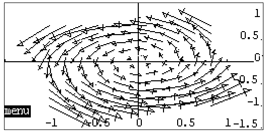

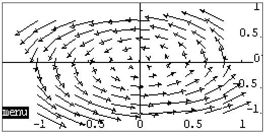

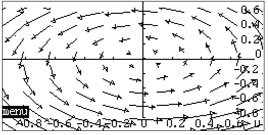

#### 示例2: 不定积分

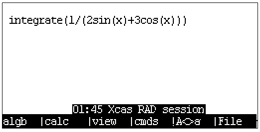

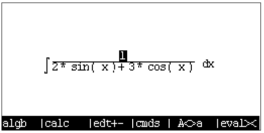

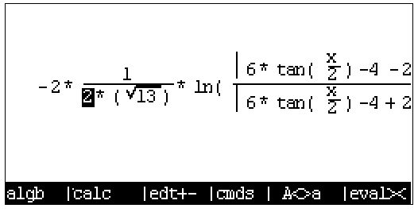

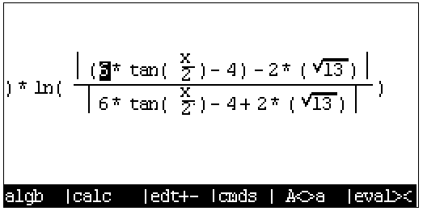

#### 示例3: 定积分

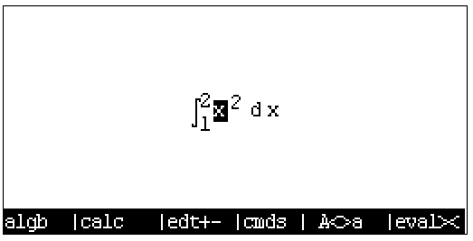


#### 示例4: 编程绘制Logistic方程映射Feigenbaum分岔图

在KhiCAS中有两种语法工作模式Xcas和Python，并提供了脚本执行功能，因此可以通过编程的方式定义新函数，这里使用Python语法来实现绘制如下的分岔图。


在主界面中按下File键(F6)，选择第六项打开脚本编辑器。

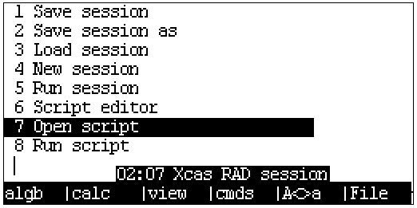

脚本编辑器中，左上角显示当前时间，语法模式，文件名，当前编辑行号/总行数。
F1~F3中存储了一些如符号判断、循环体、函数定义等的快捷命令

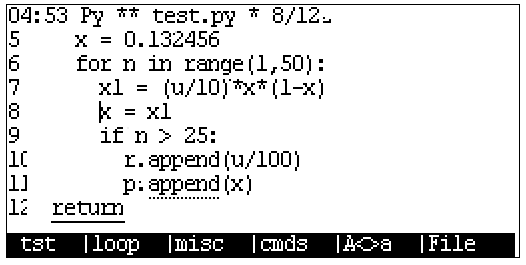

这里使用的脚本如下，首先先定义了两个全局向量r和p，函数f迭代的结果会存储在这两个向量中，最后在外部能够调用KhiCAS的point(r,p)命令进行绘图。

```python
r = []
p = []
def f():
  for u in range(0, 40):
    x = 0.132456
    for n in range(1,50):
      x1 = (u/10)*x*(1-x)
      x = x1
      if n > 25:
        r.append(u/100)
        p.append(x)
  return
```

编辑完成后使用File菜单里的Check syntax选项可以对脚本进行检查和编译，结果会输出到主控制台上。

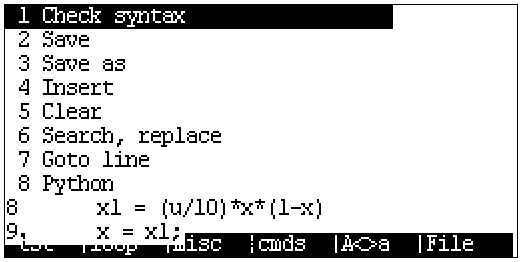

如下图为脚本有符号错误时编译的结果，会具体提示所在行号（或者是在Xcas模式下编译Python脚本也会出现错误）


编译成功的结果如下图。

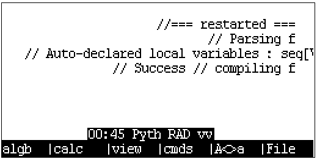

随后调用脚本中的函数名执行上面所写的函数，执行完后再调用point指令将迭代输出的散点绘制到画布上。

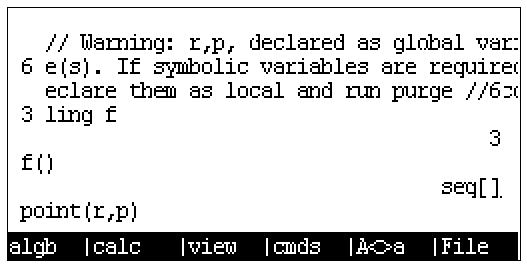

最终输出：


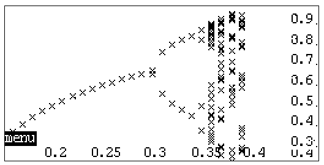

注意:

由于使用的giac代数运算系统体积相对来说较为庞大(约3MB)，而该计算器仅有300KB左右的物理内存，这里使用了Flash上的虚拟内存来填补其不足，计算过程中300KB的物理内存要承载代码的中间结果，因此在进行计算时需要频繁的IO操作进行内存交换，从而导致其在某些复杂问题求解时会出现计算十分缓慢的问题，例如在绘制如上的分岔图时，Python脚本内部迭代了约2000次，最终结果占用内存约90KB，但最终耗时长达340秒，一共触发了44万次的内存交换，并产生了约3次的全盘Flash擦写。

## 系统卸载并刷回原生系统

刷入原生系统前需要将全片Flash擦除，否则使用原生刷机工具时会卡在格式化环节。

Flash全盘擦除方法：在刷入OS Loader后或Exist OS系统运行时，按下`ON`+`F5`界面进入数据清空界面，随后按下`SYMB`键进入全盘格式化界面，再按下`F1`键后会开始全盘数据擦除操作，当显示“Operation Finish.”后操作完成，Flash数据将全部清楚且不可恢复，此时重新上电计算器并在Win7/XP环境下使用原生刷机工具即可刷入。

## 代码提交规范

**如果您想贡献代码，请遵守以下规范**

1. 变量

    * 变量采用小驼峰命名法命名。例如`windowHeight`。
    * 函数参数的命名与变量相同。
    * 不应使用单个字符命名。临时变量，循环变量除外，允许使用i，j，k等。
    * 可考虑在名称前加适当有意义的前缀，如p代表指针。
    * 不得在一行内同时定义变量和指针，如 `char *p, q;`。

2. 函数

    * 函数采用下划线命名法命名。例如`get_window_width`。
    * 函数的命名应遵循动宾关系。
    * 可考虑在名称前加适当有意义的前缀，如is代表返回值为bool类型。
    * 短小的函数可以定义为inline，函数的参数和返回值应尽量使用指针而非变量。
    * 应尽量避免使用递归，而应考虑重构为循环。

3. 常量，宏及硬件相关

    * 常量及宏采用下划线分隔大写字母的方式命名。例如`MAX_WIDTH`。

4. 自定义类型

    * 自定义类型采用下划线命名法命名（暂定）。
    * 用struct定义非单例对象时，必须使用typedef语句先定义自定义类型。

5. 运算符及其他符号

    * 一元运算符应紧贴变量，如`c++`，`*p`。
    * 二元运算符两侧都应空格，如`i == 1`，`a += 3`。例外：->运算符。
    * 三元运算符同二元运算符，如`isLeft ? 1 : 0`。
    * 逗号后应空格。
    * 在不易理解的地方应适当加注括号。

6. 伪类

    若确有面向对象的必要的，可以考虑用`typedef struct`实现伪类。

    * 伪类采用大驼峰（帕斯卡）命名法命名。

    * 伪类中保存属性，其命名与一般变量相同。

    * 伪类的方法不保存在伪类中，而采用全局函数。方法采用下划线法命名。

      * 一般方法命名为`ClassName_method_name`，其第一个参数始终应为一个指向该类型对象的指针并命名为`this`（即使不需要）。

      * 静态方法命名为`ClassName_static_method_name`。
      * 命名为`ClassName_initializer`的一般方法应在伪类的对象定义后立即调用。

7. 代码部分

    7.1

    ```c
    if (a == 1) {                          // 关键字与括号间应空格，括号与花括号间应空格
        // code here
    }else{                                 // 采用Java风格
        // code here
    }
    if (b == 1) return;                    // 块中只有一句代码时，可以不打花括号并不换行，空一格即可
    ```

    7.2

    ```c
    while (true)
        ;                                  // 使用空循环时，应将分号换行并缩进
    ```
    7.3

    ​	(a) 一般for循环的循环变量定义在for循环中：

    ```c
        for (int i = 0; i < l; i++) {
            // code here
        }
    ```

    ​	(b) 外部使用循环变量的情况，也应在此处赋初值：

    ```c
        int i;
        for (i = 0; i < l; i++) {
                // code here
        }
        return i;
    ```

    ​	(c) 不得将for循环此三处中任意一处空出：` for ( ; ; ) `，否则请使用while循环。

    7.4 禁止在需要判断语句的地方进行赋值操作，如 `if (a = 1)，(a = 1) ? a : 0 `等。

    7.5 应尽量避免使用goto语句。

    7.6 应多用switch，少用else if。switch语句中，每一个case中都最好有一个break/return语句，多个case共用完全相同的一段代码时除外。使用switch穿越时应分外小心并最好加注注释。

对于 VSCode 用户，可以使用 clang-format 扩展方便的格式化代码。

## 贡献者


## 许可协议

[GPL-3.0](./LICENSE)
