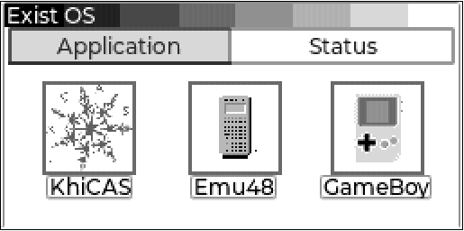
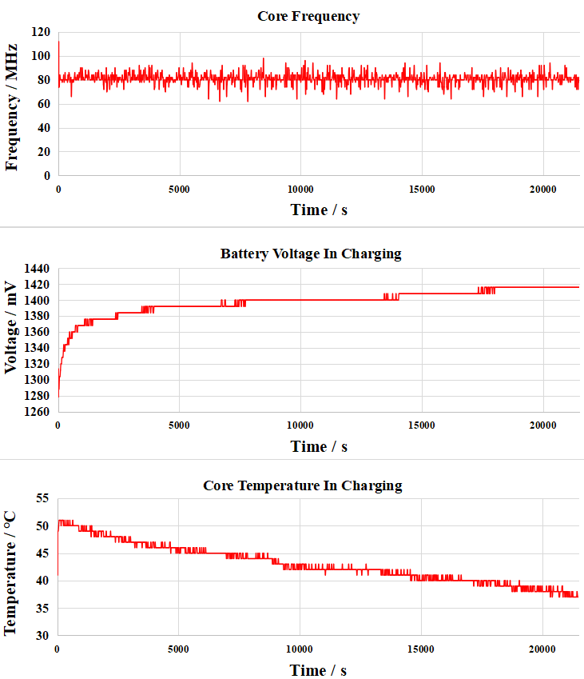
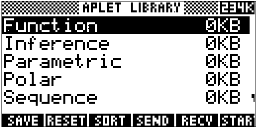

# [ExistOS-For-HP39GII](https://github.com/Repeerc/LibreCalc-For-HP39GII)

[English readme](./README_en.md)

一个开源的 HP39GII 固件项目

## 简介

[](https://opensource.org/licenses/GPL-3.0/)
[](https://github.com/ExistOS-Team/ExistOS-For-HP39GII/actions/workflows/build.yml)

本固件项目由一群计算器爱好者始创，使用了 [FreeRTOS kernel](https://github.com/FreeRTOS/FreeRTOS)、[TinyUSB](https://github.com/hathach/tinyusb)、[FatFs](http://elm-chan.org/fsw/ff/00index_e.html)、[dhara](https://github.com/dlbeer/dhara)、[giac](http://www-fourier.ujf-grenoble.fr/~parisse/giac.html) 等库。我们非常欢迎同好试用和改善本项目的代码，也非常乐意听取您的宝贵意见。期待您的参与！

## 目录

- [ExistOS-For-HP39GII](#existos-for-hp39gii)
  - [简介](#简介)
  - [目录](#目录)
  - [目前工作进展](#目前工作进展)
    - [实验性功能](#实验性功能)
    - [已知问题](#已知问题)
  - [最新编译固件下载](#最新编译固件下载)
  - [自行修改代码编译固件](#自行修改代码编译固件)
    - [准备](#准备)
      - [Windows](#windows)
      - [Linux](#linux)
        - [添加 udev 规则](#添加-udev-规则)
        - [编译 sbtool](#编译-sbtool)
    - [编译系统](#编译系统)
  - [固件安装（目前仅支持 Windows 下刷入）](#固件安装目前仅支持-windows-下刷入)
    - [刷入 OSLoader](#刷入-osloader)
      - [手动刷入](#手动刷入)
      - [自动工具刷入](#自动工具刷入)
  - [固件基本使用](#固件基本使用)
    - [初次使用](#初次使用)
    - [系统快捷键](#系统快捷键)
    - [内部存储的访问](#内部存储的访问)
    - [KhiCAS 的基本使用](#khicas-的基本使用)
      - [基本计算](#基本计算)
      - [示例1: 绘图](#示例1-绘图)
      - [示例2: 不定积分](#示例2-不定积分)
      - [示例3: 定积分](#示例3-定积分)
      - [示例4: 编程绘制 Logistic 方程映射 Feigenbaum 分岔图](#示例4-编程绘制-logistic-方程映射-feigenbaum-分岔图)
  - [实验性功能说明](#实验性功能说明)
    - [充电功能（未完全测试）](#充电功能未完全测试)
    - [Emu48 39/48 Saturn模拟器](#emu48-3948-saturn模拟器)
  - [系统卸载并刷回原生系统](#系统卸载并刷回原生系统)
  - [代码提交规范](#代码提交规范)
  - [贡献者](#贡献者)
  - [许可协议](#许可协议)


## 目前工作进展
- [x] Boot
- [x] 调试串口
- [x] LCD 256级灰度 屏幕驱动
- [x] STMP3770 中断控制器
- [x] 键盘驱动（GPIO 轮询）
- [x] 定时器驱动
- [x] CPU 频率设定
- [ ] RTC 时钟
- [x] USB 大容量存储模式
- [x] USB 串口控制台
- [x] USB 模拟键盘鼠标
- [x] USB 功能动态配置
- [x] FLASH 驱动
- [x] FATFS 文件系统
- [x] 多任务
- [x] 虚拟内存
- [ ] APP 加载
- [x] 最小化 MicroPython 实现
- [x] 用户界面 GUI
- [x] 基本电源管理
- [ ] 完全电源管理
- [x] 完全脱离官方刷机工具的固件升级

### 实验性功能

- [x] USB输入镍氢电池充电功能
- [x] Saturn模拟器运行hp39g固件
- [ ] Saturn模拟器运行hp48g固件

目前工作进展：如上。关于具体用户界面 GUI 等还在讨论中，如有宝贵意见可于 Issues 提出。

### 已知问题

由于LvGL图形库的移植仍存在某些问题，在开机绘制主界面时会有概率导致系统崩溃，需要自行手动重启系统`ON+F6`。除此之外暂未发现其它地方产生系统崩溃。


## 最新编译固件下载

固件：https://github.com/ExistOS-Team/ExistOS-For-HP39GII/releases/tag/Latest

刷机工具：https://github.com/ExistOS-Team/ExistOS_Updater_v2/releases

## 自行修改代码编译固件

- 如果您只想快捷地安装本系统而非自行编译，请自行下载 [Release](https://github.com/ExistOS-Team/ExistOS-For-HP39GII/releases) 中的固件并直接跳至 `固件安装` 章节的 [自动工具刷入](#自动工具刷入) 部分。

### 准备

需要安装 `gcc-arm-none-eabi`：  
- 对于 Windows 系统，请从[这里](https://developer.arm.com/downloads/-/gnu-rm)下载和安装。
  - 注意：需要将安装目录下的 `bin` 路径添加到 PATH 中
- 对于 Linux 系统，不同的发行版可能略有差异
  - Debian/Ubuntu 等使用 apt 包管理器的发行版请安装
    ```bash
    sudo apt-get install gcc-arm-none-eabi -y
    ```
  - Arch 等使用 pacman 包管理器的发行版请安装
    ```bash
    sudo pacman -Syu arm-none-eabi-gcc
    ```
- 对于其它系统，或者没有提供相应包的 Linux 发行版
  - 从[这里](https://developer.arm.com/tools-and-software/open-source-software/developer-tools/gnu-toolchain/downloads)下载源代码编译安装

#### Windows

请下载 [Ninja](https://github.com/ninja-build/ninja/releases)，解压到任意目录下，然后将该目录添加到 PATH 中。

#### Linux

##### 添加 udev 规则

对于 Linux 系统，为了让 udev 识别 HP39GII，需要将本项目根目录下的 `99-hp39gii.rules` 复制到 `/etc/udev/rules.d/`：  
```bash
sudo cp 99-hp39gii.rules /etc/udev/rules.d/
```

然后重启 `udev` 以载入规则：  
```bash
sudo service udev restart
```
如果上面的命令不起作用：  
```bash
sudo udevadm control --reload-rules
sudo udevadm trigger
```

##### 编译 sbtool

本项目为 Windows 预先编译好了相应文件，但是 Linux 下需要手动编译。

进入项目目录 `tools/sbtools` 并 `make` 编译（无需安装），可能需要安装以下库：  
- libusb (1.0)
- libcrypto++
  - 安装教程见于 [Crypto++ Wiki](https://cryptopp.com/wiki/Linux#Distribution_Package)

- Ubuntu 发行版请参考本项目的 Action 文件安装相应库
  ```bash
  sudo apt-get install libcrypto++6 libcrypto++-dev libusb-1.0-0-dev -y
  ```
- Arch 请安装以下库
  ```bash
  sudo pacman -Syu libusb crypto++
  ````

若 `pkg-config` 提示找不到 libcrypto++ 或其它库，请检查是否安装了相应库，确认 `/usr/lib/pkgconfig/` 下是否有对于库的的 `.pc` 文件，这是使 pkg-config 识别它所需要的。  
若有，请手动修改 Makefile。  
若无，可能需要重新安装相应库，或手动修改 Makefile 中的 pkg-config 命令。

然后进入 `Libs/src/micropython-master/ports/eoslib` 目录并 `make`：  
```bash
cd Libs/src/micropython-master/ports/eoslib
make
```

### 编译系统

新建一个文件夹用于存放编译的二进制文件和缓存：  
```bash
mkdir build
cd build
```

准备编译：  
```bash
cmake ..
```
Windows 请用以下命令指定用 Ninja 作为编译器：  
```bash
cmake .. -G Ninja
```

编译：  
```bash
make
```
Windows 请用 Ninja：  
```bash
ninja
```

## 固件安装（目前仅支持 Windows 下刷入）

### 刷入 OSLoader

注意：HP39GII 的相关驱动程序请自行安装。

OSLoader 是引导程序，用于加载 ExistOS 并提供底层 API 和虚拟内存相关功能，使用下面的命令刷入 OSLoader（需要计算器处在刷写模式）。

要刷写 OSLoader，需要先将计算器完全断电（卸下所有电池），按住 `ON/C` 键不放，之后插入 USB 数据线。

Windows 系统下可以查看设备管理器是否出现一个名为 “USB 输入设备” 且 ID 为 066F:3770 的 USB HID 设备


#### 手动刷入

先使用 sbtool 工具将 OSLoader 载入 RAM 并运行
```bash
ninja sb_flash
```
当 OSLoader 运行后，计算器会显示如下界面提示“找不到系统”：


此时 OSLoader 仅在内存中运行，接着执行以下将 OSLoader 刷入计算器的 Flash 引导区
```bash
ninja edb_flash_loader
```
刷入 OSLoader 后计算器会自动重启，但仍找不到系统，最后需要执行以下将系统刷入计算器的 Flash
```bash
ninja edb_flash_sys
```
刷入完成后系统将会重启并正常运行，若长时间无反应请尝试从头开始刷入。

#### 自动工具刷入

可使用 [ExistOS Updater](https://github.com/ExistOS-Team/ExistOS_Updater_v2/releases)（可在 Windows 10 或更新的版本上使用）刷入 OSLoader 和 System。

在没有刷入过OSLoader的设备（如安装了官方固件的设备）上，请将计算器完全关机，按住 `ON/C` 键将计算器连接至电脑。单击软件中的 `Refresh` 按钮后，如Status栏显示 `Device Connected [HostLink Mode]` ，便可以选择OSLoader和System镜像，并单击 `Update OSLoader & System` 按钮开始刷写。

在已经刷入了OSLoader的设备上，只需将设备正常开机并连接电脑，单击软件中的 `Refresh` 按钮，在Status栏显示 `Device Connected [Bin Mode EDB]` 后便可进行刷写。

或尝试安装 HP39GII 官方工具然后使用其 Firmware Updater 刷入 OSLoader（将编译的 `OSLoader.sb` 重命名为 `firmware.sb` 并替换官方固件 `firmware.sb`，确保文件名相同）。

## 固件基本使用

### 初次使用

系统编译和安装完成后，第一次开机将会见到如下系统界面，提示将 Flash 的数据区格式化为 FAT16 格式的文件系统，`ENTER` 点击 OK 开始格式化，大约耗时半分钟。


出现以下界面后表示 Flash 数据区已经格式化完毕，点击 OK 进入系统主界面。


目前系统预置了两个应用，一个KhiCAS用于进行代数计算，Emu48目前为实验应用，用于模拟hp39g/48g系计算器系统（目前实现了对39g的基本模拟），将固件文件放入计算器后即可启动，[←][→][↑][↓]键选择，[ENTER]键确定/切换



Status选项卡用于显示当前系统状态，以及相关的参数设定。


### 系统快捷键

以下快捷键在任何界面均可起作用（包括系统崩溃时）

```
  ON + F3 强制关机
  ON + F5 进入格式化界面
  ON + F6 强制重启
```

### 内部存储的访问

在系统开机前（或按下 `ON/C` 开机之后立即）按住 `F2` 键不放，会出现如下界面：


屏幕出现 USB MSC Mode字符后使用USB线缆接入计算机即可访问存储空间，此时电脑上会出现一个约80MB的U盘，System为系统资源（字体、图片之类，目前暂不使用），xcas文件夹存放KhiCAS的用户脚本、会话(历史记录)等资料。操作完文件后务必使用安全弹出防止文件损坏，安全弹出时计算器会对写入Flash内容进行同步和整理，可能会出现短暂的卡顿，请耐心等待。


### KhiCAS 的基本使用

主界面 Application 选项卡中按下 `↓` 键选中 `KhiCAS` 应用，按下 `Enter` 键启动应用。第一次启动时会弹出提示选择使用 Xcas 语法模式 `F1` 还是 Python 语法模式 `F6`。


设定完成后当前状态会显示在下边的状态栏，其中第一项为当前时间，第二项为语法模式（Xcas 或 Python），第三项弧度或角度制，第四项为当前会话文件名。

注：目前 RTC 函数接口还未适配，故时间显示可能是混乱的。


初始化完成后便可以进行一些相关的计算。

[ON/C]清除历史记录。

[SHIFT]+[ON/C]保存会话并关机。

#### 基本计算

在 KhiCAS 中可以输入一般的表达式进行计算，支持大整数计算，但对于小数仅支持单精度浮点。


对于输入的表达式（或 `↑` `↓` 键选择的历史记录）可以按下 View 键 `F3` 后将其转化为自然输入模式进行编辑。


使用 `F1` 和 `F2` 键可以调出可能常用的指令菜单。


`cmds` 菜单 (`F4`) 里用二级目录的方式列出了 KhiCAS 中的全部命令（包括代数、复数、多项式、概率、绘图等命令），可以在其中搜寻需要的指令，选中对应的指令后 `input` 键输入到主界面，或按下 `help` 查看指令帮助，`ex1`、`ex2` 键输入自带的示例。


#### 示例1: 绘图

使用 `plot` 命令可以对基本函数进行绘图，绘图界面 `↑` `↓` `←` `→` 键移动画布，`+` `-` 键缩放，`*` 键自动缩放铺满屏幕，`/` 键自动缩放让 x y 坐标刻度等距。

```
  plot(表达式, x)
  plot(表达式, x=[起点...终点], xstep=步进)
```


`plotpolar` 命令则在极坐标系下绘图


`plotfield` 绘制矢量场


#### 示例2: 不定积分


#### 示例3: 定积分


#### 示例4: 编程绘制 Logistic 方程映射 Feigenbaum 分岔图

在 KhiCAS 中有两种语法工作模式 Xcas 和 Python，并提供了脚本执行功能，因此可以通过编程的方式定义新函数，这里使用Python语法来实现绘制如下的分岔图。


在主界面中按下 File 键 (`F6`)，选择第六项打开脚本编辑器。


脚本编辑器中，左上角显示当前时间，语法模式，文件名，当前编辑行号/总行数。
`F1`~`F3`中存储了一些如符号判断、循环体、函数定义等的快捷命令


这里使用的脚本如下，首先先定义了两个全局向量 `r` 和 `p` ，函数 `f` 迭代的结果会存储在这两个向量中，最后在外部能够调用 KhiCAS 的 `point(r,p)` 命令进行绘图。

```python
r = []
p = []
def f():
  for u in range(0, 40):
    x = 0.132456
    for n in range(1,50):
      x1 = (u/10)*x*(1-x)
      x = x1
      if n > 25:
        r.append(u/100)
        p.append(x)
  return
```

编辑完成后使用 File 菜单里的 Check syntax 选项可以对脚本进行检查和编译，结果会输出到主控制台上。


如下图为脚本有符号错误时编译的结果，会具体提示所在行号（或者是在 Xcas 模式下编译 Python 脚本也会出现错误）


编译成功的结果如下图。


随后调用脚本中的函数名执行上面所写的函数，执行完后再调用 point 指令将迭代输出的散点绘制到画布上。


最终输出：


注意:

由于使用的 giac 代数运算系统体积相对来说较为庞大（约 3 MB），而该计算器仅有 300 KB 左右的物理内存，这里使用了 Flash 上的虚拟内存来填补其不足，计算过程中 300 KB 的物理内存要承载代码的中间结果，因此在进行计算时需要频繁的 IO 操作进行内存交换，从而导致其在某些复杂问题求解时会出现计算十分缓慢的问题，例如在绘制如上的分岔图时，Python 脚本内部迭代了约 2000 次，最终结果占用内存约 90 KB，但最终耗时长达 340 秒，一共触发了 44 万次的内存交换，并产生了约 3 次的全盘 Flash 擦写。

## 实验性功能说明

### 充电功能（未完全测试）

目前固件支持通过控制SoC内部DCDC和线性稳压器从USB取电，降压到1.4V后输出给电池仓进行充电，因此使用该功能时务必使用可充电电池，以防发生危险。

使用方法：接入USB线后切换到`Status`界面，滚动至最底部勾选`Enable Charge`后电池仓开始输出电流，查看上面显示信息可以看到核心温度上升至50℃左右，这是因为充电相关的升降压电路是和CPU集成在同一芯片内。


以下是使用一节标称400mAh 1.2V AAAA电池测试充电时绘制的系统状况曲线（充电时间：5小时）：



以下是使用一节标称400mAh 1.2V AAAA电池测试放电时绘制的系统状况曲线（放电时间：2小时）：


### Emu48 39/48 Saturn模拟器

该功能可以通过运行Saturn虚拟机的方式运行HP39/48系列计算器的固件，目前仅完成了hp 39g固件的加载，退出和数据保存功能还未完成，且未进行相关优化，速度较慢。

使用方法：将HP 39g计算器的固件 rom.g39 (1MB) 放置到计算器存储空间的根目录下，在系统应用主界面点击Emu48后即可使用，故载入速度较慢，请耐心等待。

重启：`ON + F6`

关机：`ON + F3`




## 系统卸载并刷回原生系统

刷入原生系统前需要将全片 Flash 擦除，否则使用原生刷机工具时会卡在格式化环节。

Flash全盘擦除方法：在刷入OS Loader后或Exist OS系统运行时，按下`ON`+`F5`界面进入数据清空界面，随后按下`SYMB`键进入全盘格式化界面，再按下`F1`键后会开始全盘数据擦除操作，当显示“Operation Finish.”后操作完成，Flash数据将全部清除且不可恢复，此时重新上电计算器并在Win7/XP环境下使用原生刷机工具即可刷入。

## 代码提交规范

**如果您想贡献代码，请遵守以下规范**

1. 变量

    * 变量采用小驼峰命名法命名。例如 `windowHeight`。
    * 函数参数的命名与变量相同。
    * 不应使用单个字符命名。临时变量，循环变量除外，允许使用 i，j，k 等。
    * 可考虑在名称前加适当有意义的前缀，如 p 代表指针。
    * 不得在一行内同时定义变量和指针，如 `char *p, q;`。

2. 函数

    * 函数采用下划线命名法命名。例如 `get_window_width`。
    * 函数的命名应遵循动宾关系。
    * 可考虑在名称前加适当有意义的前缀，如 is 代表返回值为 bool 类型。
    * 短小的函数可以定义为 inline，函数的参数和返回值应尽量使用指针而非变量。
    * 应尽量避免使用递归，而应考虑重构为循环。

3. 常量，宏及硬件相关

    * 常量及宏采用下划线分隔大写字母的方式命名。例如 `MAX_WIDTH`。

4. 自定义类型

    * 自定义类型采用下划线命名法命名（暂定）。
    * 用 struct 定义非单例对象时，必须使用 typedef 语句先定义自定义类型。

5. 运算符及其他符号

    * 一元运算符应紧贴变量，如 `c++`，`*p`。
    * 二元运算符两侧都应空格，如 `i == 1`，`a += 3`。例外：->运算符。
    * 三元运算符同二元运算符，如 `isLeft ? 1 : 0`。
    * 逗号后应空格。
    * 在不易理解的地方应适当加注括号。

6. 伪类

    若确有面向对象的必要的，可以考虑用 `typedef struct` 实现伪类。

    * 伪类采用大驼峰（帕斯卡）命名法命名。

    * 伪类中保存属性，其命名与一般变量相同。

    * 伪类的方法不保存在伪类中，而采用全局函数。方法采用下划线法命名。

      * 一般方法命名为 `ClassName_method_name`，其第一个参数始终应为一个指向该类型对象的指针并命名为 `this`（即使不需要）。

      * 静态方法命名为 `ClassName_static_method_name`。
      * 命名为 `ClassName_initializer` 的一般方法应在伪类的对象定义后立即调用。

7. 代码部分

    7.1

    ```c
    if (a == 1) {                          // 关键字与括号间应空格，括号与花括号间应空格
        // code here
    }else{                                 // 采用Java风格
        // code here
    }
    if (b == 1) return;                    // 块中只有一句代码时，可以不打花括号并不换行，空一格即可
    ```

    7.2

    ```c
    while (true)
        ;                                  // 使用空循环时，应将分号换行并缩进
    ```
    7.3

    ​	(a) 一般 for 循环的循环变量定义在 for 循环中：

    ```c
        for (int i = 0; i < l; i++) {
            // code here
        }
    ```

    ​	(b) 外部使用循环变量的情况，也应在此处赋初值：

    ```c
        int i;
        for (i = 0; i < l; i++) {
                // code here
        }
        return i;
    ```

    ​	(c) 不得将for循环此三处中任意一处空出：`for ( ; ; )`，否则请使用while循环。

    7.4 禁止在需要判断语句的地方进行赋值操作，如 `if (a = 1)，(a = 1) ? a : 0` 等。

    7.5 应尽量避免使用 goto 语句。

    7.6 应多用 switch，少用 else if。switch 语句中，每一个 case 中都最好有一个 break/return 语句，多个 case 共用完全相同的一段代码时除外。使用 switch 穿越时应分外小心并最好加注注释。

对于 VSCode 用户，可以使用 clang-format 扩展方便的格式化代码。

## 贡献者


## 许可协议

[GPL-3.0](https://github.com/Repeerc/LibreCalc-For-HP39GII/blob/master/LICENSE)
