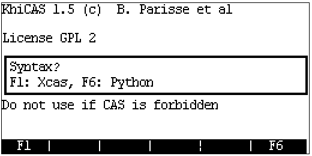
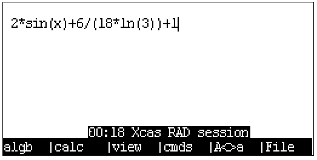
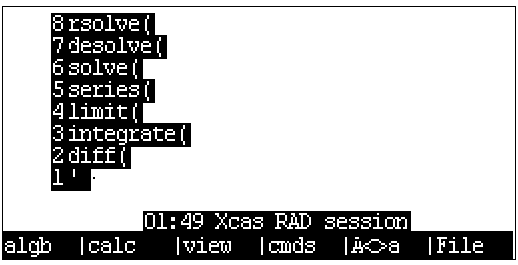
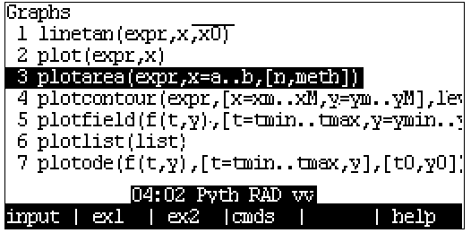
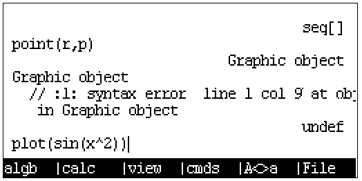
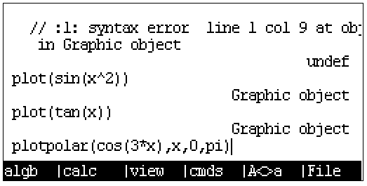
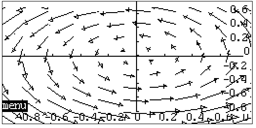
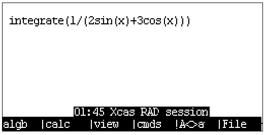
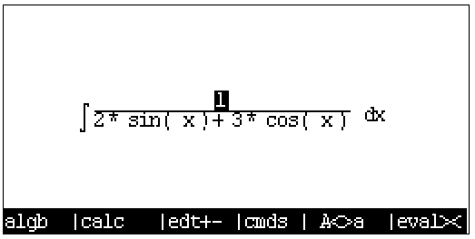
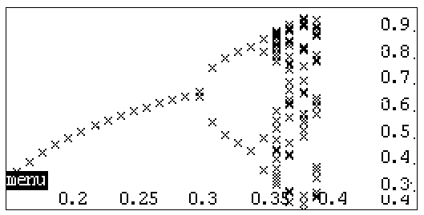

 ___This English readme may not be up to date with the [Chinese version](./README.md).___

# [ExistOS-For-HP39GII](https://github.com/Repeerc/LibreCalc-For-HP39GII)

An open source HP39GII firmware project

## Project Overview

[](https://opensource.org/licenses/GPL-3.0/)
[](../../actions/workflows/build.yml)

This firmware project is created by a group of calculator enthusiasts, using libraries such as [FreeRTOS kernel](https://github.com/FreeRTOS/FreeRTOS), [TinyUSB](https://github.com/hathach/tinyusb), [FatFs](http://elm-chan.org/fsw/ff/00index_e.html), [dhara](https://github.com/dlbeer/dhara), [giac](http://www-fourier.ujf-grenoble.fr/~parisse/giac.html), etc. Like-minded friends are more than welcome to try out and improve the code of this project. We'd love to hear your voices!

## Contents

- [ExistOS-For-HP39GII](#existos-for-hp39gii)
  - [Project overview](#project-overview)
  - [Contents](#contents)
  - [Current development status](#current-development-status)
	- [Experimental features](#experimental-features)
  - [Compiling](#compiling)
    - [Prerequisites](#prerequisites)
      - [Windows](#windows)
      - [Linux](#linux)
        - [Add udev rules](#add-udev-rules)
        - [Compiling sbtool](#compiling-sbtool)
    - [Compiling ExistOS](#compiling-existos)
  - [Installing firmware (Currently only works under Windows)](#installing-firmware-currently-only-works-under-windows)
    - [Flashing OSLoader](#flashing-osloader)
      - [Manual flashing](#manual-flashing)
      - [Flashing with automated tools](#flashing-with-automated-tools)
  - [Basic usage of firmware](#basic-usage-of-firmware)
    - [Booting for the first time](#booting-for-the-first-time)
    - [Accessing internal storage](#accessing-internal-storage)
    - [Basic usage of KhiCAS](#basic-usage-of-khicas)
      - [Basic calculations](#basic-calculations)
      - [Example 1: Plotting](#example-1-plotting)
      - [Example 2: Indefinite integrals](#example-2-indefinite-integrals)
      - [Example 3: Definite integrals](#example-3-definite-integrals)
      - [Example 4: Programming to draw Feigenbaum bifurcation diagrams mapped with Logistic equations](#example-4-programming-to-draw-feigenbaum-bifurcation-diagrams-mapped-with-logistic-equations)
  - [Uninstalling ExistOS and flashing back to stock system](#uninstalling-existos-and-flashing-back-to-stock-system)
  - [Code submision standard](#code-submission-standard)
  - [Contributors](#contributors)
  - [License](#license)


## Current Developping Status

- [x] Boot
- [x] Serial debugging
- [x] LCD driver supporting 256 shades of grey
- [x] STMP3770 interrupt controller
- [x] Keyboard driver (GPIO polling)
- [x] Timer driver
- [x] Setting CPU frequency
- [x] Real-time clock
- [x] USB mass storage device mode
- [x] USB serial console
- [x] USB keyboard & mouse emulation
- [x] USB functions dynamic configuration
- [x] Flash driver
- [x] FATFS implementation
- [x] Multitasking
- [x] Virtual memory
- [x] Loading applications
- [x] Miminal MicroPython implementation
- [x] Graphical user interface
- [x] Basic power management
- [ ] Complete power management
- [x] Firmware updating independent of stock tools

### Experimental features

- [x] Charging Ni-Mh batteries in the compartment via USB power
- [x] Running hp39g firmware with Saturn emulator
- [ ] Running hp48g firmware with Saturn emulator

Current development status is as described above. User interface etc. are still under discussion. You may open an issue to give your opinion.

## Only Installing

### For Windows 10 / 11: ExistOS Updater

Requires:

- Firmware: Download from [here](https://github.com/ExistOS-Team/ExistOS-For-HP39GII/releases).
  - Download `OSLoader.sb` and `ExistOS.sys`.
- ExistOS Updater: Download from [here](https://github.com/ExistOS-Team/ExistOS_Updater_v2/releases).
  - Only supports Windows 10 / 11.

### For Windows / Linux

Requires:

- Firmware: Download from [here](https://github.com/ExistOS-Team/ExistOS-For-HP39GII/releases).
  - Download `OSLoader.sb` and `ExistOS.sys`.
- sb_loader: Used to send OSLoader to the RAM of your calculator if you haven't installed it before.
  - Windows: Download binary file from [here](../../raw/main/tools/sbtools_win/sb_loader.exe).
  - Linux: Download zip file from [here](../../archive/refs/heads/main.zip) and  extract it. Then run the following commands:
    - `cd tools/sbtools/`
    - `make`
    - Then you will get executable file `sb_loader`
- EDB (ExistOS Debug Brige): Used to flash firmwares.
  - Windows: Download binary file from [here](../../raw/main/tools/edb.exe).
  - Linux: Download zip file from [here](https://github.com/ExistOS-Team/edb-unix/archive/refs/heads/main.zip) and extract it. Then run the following commands:
    - `mkdir build`
    - `cmake -B build`
    - `cmake --build build`
    - Then you will get the executable file `edb`

Put the mentioned files to a directory.

If you haven't installed ExistOS on your calculotor, please get through the to-do list below first:
1. Remove all batteries from your calculator.
2. Hold `ON/C` key and connect your calculator to computer via USB cable.
3. Run command `sbloader -f OSLoader.sb`
  - Normally your calculator will boot into the OSLoader, and then a message will be shown on the screen. There is no need to unplug the USB cable now. Just continue to do the following steps.
  - 

The ExistOS had been installed on your device:
1. Connect your calculator to computer via USB cable.
2. Run command `edb -r -s -f OSLoader.sb 1408 b` to flash the OSLoader.
  - Your calculator will reboot automatically.
3. Run command `edb -r -s -f ExistOS.sys 1984` to flash the System.
  - Your calculatr will reboot automatically.
4. Enjoy the ExistOS!
  - If you are in trouble with the installation or anything else, open an issue or join our Discord server to seek for help.

## Compiling and Installing

### Preparations

Clone the git repo first:
```bash
git clone https://github.com/ExistOS-Team/ExistOS-For-HP39GII.git # https
git clone git@github.com:ExistOS-Team/ExistOS-For-HP39GII.git # ssh
```
Then enter the directory:
```bash
cd ExistOS-For-HP39GII
```
Switch to the root directory of this project first.

Note:
- `gcc-arm-none-eabi` v10.3 is tested OK. Download binary executable file from [here](https://developer.arm.com/-/media/Files/downloads/gnu-rm/10.3-2021.10/gcc-arm-none-eabi-10.3-2021.10-x86_64-linux.tar.bz2).
  - Using other versions of GCC may make the device unable to boot.

|System|Install|
|----|----|
|Windows|Download from [here](https://developer.arm.com/-/media/Files/downloads/gnu-rm/10.3-2021.10/gcc-arm-none-eabi-10.3-2021.10-win32.exe?rev=29bb46cfa0434fbda93abb33c1d480e6&hash=B2C5AAE07841929A0D0BF460896D6E52) and install `gcc-arm-none-eabi`|
||Do not forget to add directory to the PATH environment variable|
|Debian & Ubuntu|`apt-get install gcc-arm-none-eabi`|
|Arch Linux|`pacman -Syu arm-none-eabi-gcc`|
|Other|Lookup if there are binary packages provided. Or you can build from [source code](https://developer.arm.com/tools-and-software/open-source-software/developer-tools/gnu-toolchain/downloads)|
||The link above is the new version. You can download the old version (V10.3) form [here](https://developer.arm.com/downloads/-/gnu-rm#panel1a)|

Add `udev` rule:
|System|Install|
|----|----|
|Windows|N/A|
|Linux|`sudo cp 99-hp39gii.rules /etc/udev/rules.d/`|
||Then restart `udev` to load new rule:|
||`sudo service udev restart`|
||If command above didn't work:|
||`sudo udevadm control --reload-rules`|
||`sudo udevadm trigger`|

Install compiler:
|System|Install|
|----|----|
|Windows|Download binary executable of [Ninja](https://github.com/ninja-build/ninja/releases), exract it to a directory in your PATH|
|Debian & Ubuntu|`apt-get install cmake make`|
|Arch Linux|`pacman -Syu cmake make`|

Install requirements:
|System|Install|
|----|----|
|Windows|N/A|
|Debian|`apt-get install libcrypto++-dev libusb-1.0.0-dev`|
|Ubuntu|`apt-get install libcrypto++6 libcrypto++-dev libusb-1.0.0-dev`|
|Arch Linux|`pacman -Syu libusb crypto++`|
|Other|Install libusb 1.0, [libcrypto++](https://cryptopp.com/wiki/Linux#Distribution_Package)|
||Check installtion with `pkg-config`|

_Tips: `pkg-config` will search `/usr/lib/pkgconfig/*.pc` for libraries._

Build `sbtool`:
|System|Install|
|----|----|
|Windows|Binary executable in `tools/`|
|Linux|`cd tools/sbtools/ && make`|
||`cp sb_loader ../`|
||`cp elftosb ../`|
||`cd ../../`|
||`cd Libs/src/micropython-master/ports/eoslib/ && make`|
||`cd ../../../../../`|

Build `EDB`:
|System|Install|
|----|----|
|Windows|Binary executable in `tools/`|
|Linux|`cd tools/`|
||`git clone https://github.com/ExistOS-Team/edb-unix.git`|
||`cd edb-unix/`|
||`mkdir build`|
||`cmake -B build/`|
||`cmake --build build/`|
||`cp build/edb ../`|
||`cd ../../`|

### Compiling ExistOS

Create a new directory to store binary files and caches
```bash
mkdir build
cd build
```

Preparing to compile:
|System|Install|Note|
|----|----|----|
|Windows|`cmake .. -G Ninja`|Assumed `Ninja` as complier|
|Linux|`cmake ..`||

Compiling:
|System|Install|
|----|----|
|Windows|`ninja`|
|Linux|`make`|

### Installing

Note: Please install drivers for HP39GII by yourself.

#### OSLoader in RAM (temporarily)

You can skip this step if the OSLoader had been installed on your device.

The OSLoader can boot ExistOS and provides low-level APIs and virtual memory service. Run commands below to load the OSLoader temporarily.

Before flashing, power off your calculator completely by removing the batteries, and then plug in USB cable while holding down the `ON/C` key. Then your calculator will enter the flashing mode.

An HID device named "USB Input Device" with the ID of 066F:3770 will show up in the Device Manager under the Windows.


|System|Install|
|---|---|
|Windows|`ninja sb_flash`|
|Linux|`make sb_flash`|

#### OSLoader

|System|Install|
|----|----|
|Windows|`ninja edb_flash_loader`|
|Linux|`make edb_flash_loader`|

This will flash OSLoader to the calculator.

Your calculator will reboot automatically.

#### ExistOS

|System|Install|
|----|----|
|Windows|`ninja edb_flash_sys`|
|Linux|`make edb_flash_sys`|

This will install ExistOS on your calculator.

Your calculator will reboot automatically.

## Emulator


Download form [here](https://github.com/ExistOS-Team/ExistOS-Emulator/releases/tag/Latest).

## Basic Usage of the Firmware

### Booting for the first time

During the first boot after the installation you will see the following dialog, prompting you to format the data section of the flash as FAT16. Press `ENTER` to confirm the operation, which usually takes around 30 seconds.


This screen indicates a successful format. Select OK to enter the main menu.


This system only comes with a KhiCAS application for now. Press `←` `→` `↑` `↓` to navigate and `ENTER` to confirm.


The status tab currently shows the system status.


### Shortcuts

`ON` + `F5`: Enter the maintenance menu

`ON` + `[+]` / `[-]`: Adjust the contrast

### Accessing internal storage

Holding down the `F2` key while booting (or immediately after pressing the `ON/C` key) will bring up the following interface:


An 80 MB USB drive, the data section of the onboard flash, will show up on your computer. The `System` directory stores the assets, for example, fonts and pictures (Unused right now). The `xcas` directory stores KhiCAS user scripts, sessions (history) and other datas.


### Basic usage of KhiCAS

Press `↓` to select the KhiCAS app under the Application tab in the main menu, and press `ENTER` to launch it. A dialog will show up on the first launch, which is for you to choose between Xcas mode `F1` and Python mode `F6`.



After the configurations, the current status is shown on the status bar below. The first item is the current time, the second is the mode (Xcas or Python), the third is the filename of the current session.

Use `time(hh, mm)` to set the time.


Calculations can be performed after initialization.

Long press the `ON/C` key to clear the history.

Press `SHIFT` + `ON/C` to save the session and quit KhiCAS.

#### Basic calculations

General expressions can be entered in KhiCAS to perform calculations. Calculation of large integers is supported. However for floating point calculation, only single-percision floating point numbers calculation is supported.


For an expression entered in linear mode, select View (`F3`) to edit it in the natural textbook editor.




Press `F1` and `F2` to bring up *could-be* commonly-used commands menu.




The `cmds` menu (`F4`) lists all available commands in KhiCAS as nested entries, including algebraic, complex, polynominal, probability, plotting, etc., where you can search commands needed. After selecting the command, press `Input` to copy them to the main menu, `ex1` `ex2` to copy built-in examples or `help` to show built-in help.




#### Example 1: Plotting

Use `plot` command to plot functions. In the plot interface: Press `↑` `↓` `←` `→` to move the canvas, `+``-` to zoom, `*` to auto-zoom and fill the screen, `/` to auto-zoom and keep the scale of the axes equal.

```
  plot(expression, x)
  plot(expression, x=[start...end], xstep=step)
```




`plotpolar` command plots in polar coordinate system.




`plotfield` command draws vector fields.




#### Example 2: Indefinite integrals






#### Example 3: Definite integrals


#### Example 4: Programming to draw Feigenbaum bifurcation diagrams mapped with Logistic equations

Two input syntax modes are present in KhiCAS, namely Xcas and Python. With the ability to execute scripts, new functions can be defined via programming. Here we use Python syntax to implement the following bifurcation diagram.


Press `File` (F6) in the main menu and select the 6th item to open the script editor.


In the editor, the top left corner shows current time, syntax mode, filename and current line/total lines. `F1`~`F3` stores shortcut commands such as symbolic conditionals, loop bodies, function definitions, etc.


The script we are using is as follows. First we define two global vectors `r` and `p`, where the result of function `f` iteration will be stored. Then we can plot by calling KhiCAS command `point(r,p)` externally.

```python
r = []
p = []
def f():
  for u in range(0, 40):
    x = 0.132456
    for n in range(1,50):
      x1 = (u/10)*x*(1-x)
      x = x1
      if n > 25:
        r.append(u/100)
        p.append(x)
  return
```

After editing, the script can be checked and compiled using the Check syntax option in the File menu, and the result will be output to the console.


The following figure shows the result of compiling a script with a symbolic error, with a specific indication of the line number. (Compiling Python scripts in Xcas mode also causes error.)


The result of a successful compilation is shown below.


The function name in the script is called to execute the function written above, and the `point` command is then called to draw the scattered data to the canvas.


Final output:




## Uninstalling ExistOS and Flashing Back to the HP Firmware

You need to erase the whole flash before flashing back to the HP Firmware, otherwise you'll get stuck at the formatting progress when using the official update tool.

How to erase the whole flash:  
After flashing OSLoader or while ExistOS is running, press `ON`+`F5` to enter the maintenance menu, and then press `F2` to erase the flash. ___This operation cannot be undone.___ When the screen shows "Flash Cleared", connect the calculator to a computer and launch the official update tool under Windows 7 / XP to flash your calculator back to the HP firmware.

## Code Submission Standard

**If you want to contribute to this project, please follow the standards below**

1. Variable

    * Variables are named using lower camel case. For example, `windowHeight`
    * Function parameter naming is the same as variable.
    * Don't name using a single letter except for temporary or loop variable. 
    * It is prefered to add some meaningful prefix. For example, `p` means pointer.
    * Don't define variable and pointer at the same time on one line, such as `char *p, q;`

2. Function

    * Functions are named using underline. For example, `get_window_width`。
    * Function names should follow the Verb - object relationship.
    * It is prefered to add some meaningful prefix. For example, `is` means the type of return value is bool.
    * Short function can be defined as inline, function parameters and return values should be pointer instead of variable.
    * Avoid using recursion, consider refactoring to cycling.

3. Constant, macro and hardware-related

    * Constants and macros are named using underline to divide upper-case letters. For example, `MAX_WIDTH`。

4. Custom type

    * Custom type names are named using underline (tentative).
    * Must use typedef to define a custom type before using struct to define non-single-instance object.

5. Operator and other symbol

    * Unary operators should appress the variable, such as `c++`, `*p`.
    * Binary operators shold have spaces on both sides, such as `i == 1`, `a += 3`, except for `->`
    * Ternary are the same as binary, such as `isLeft ? 1 : 0`.
    * commas should be followed by a space.
    * Parentheses should be added appropriately where it is not easy to understand.

6. Pseudo-class

    If object-oriented is necessary, you can consider using `typedef struct` as pseudo-class.

    * Pseudo classes should be named by the upper camel case (Pascal) name.

    * For properties inside the class, its name is the same as the general variable.

    * Pseudo-class methods are not saved in pseudo-classes, but are global functions. Methods should be named using underline.

      * Normal method should be named as `ClassName_method_name`, the first parameter should always be a pointer to the instance and be named `this` (even unnecessary).

      * Static method should be named as`ClassName_static_method_name`。
      * General method named `ClassName_initializer` should be called right after an instance is defined.

7. Coding

    7.1

    ```c
    if (a == 1) {                          // There should be spaces between keywords and brackets, and spaces between brackets and curly brackets
        // code here
    }else{                                 // Use Java style
        // code here
    }
    if (b == 1) return;                    // When there is only one sentence of code in the block, you can leave a blank space without curly braces
    ```

    7.2

    ```c
    while (true)
        ;                                  // When using empty loops, you should wrap the semicolon and indent it
    ```
    7.3

    ​	(a) The loop variable of a general for loop is defined in the for loop:

    ```c
        for (int i = 0; i < l; i++) {
            // code here
        }
    ```

    ​	(b) In cases where circular variables are used externally, an initial value should also be given here:

    ```c
        int i;
        for (i = 0; i < l; i++) {
                // code here
        }
        return i;
    ```

    ​	(c) Do not leave any of the three of for loops empty: ` for ( ; ; ) `, otherwise use the while loop.

    7.4 Don't use assignment where a sentence needs to be judged, such as `if (a = 1), (a = 1) ? a : 0 `.

    7.5 The goto statement should be avoided as much as possible.

    7.6 Switch should be used more than else if.In a switch statement, it is best to have a break/return statement in each case, except when multiple cases share exactly the same piece of code.Care should be taken when using switch traversal and it is best to comment on it.

For VSCode users, `clang-format` extension is available to format the code conveniently.

## Contributors

<a href = "https://github.com/ExistOS-Team/ExistOS-For-HP39GII/graphs/contributors">
  
</a>

## License

[GPL-3.0](./LICENSE)
