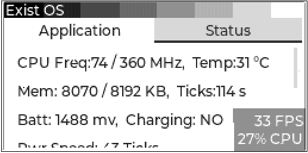

# [ExistOS-For-HP39GII](https://github.com/Repeerc/LibreCalc-For-HP39GII)

[中文自述文件](./README.md)

An open source HP39GII firmware project

## Project brief

[](https://opensource.org/licenses/GPL-3.0/)
[](https://github.com/ExistOS-Team/ExistOS-For-HP39GII/actions/workflows/build.yml)

This firmware project is created by a group of calculator enthusiasts, used some libraries such as [FreeRTOS kernel](https://github.com/FreeRTOS/FreeRTOS), [TinyUSB](https://github.com/hathach/tinyusb), [FatFs](http://elm-chan.org/fsw/ff/00index_e.html), [dhara](https://github.com/dlbeer/dhara)and etc. We very welcome some like-minded friends to try and improve the code for this project, and very want to get your valueable advices. Hoping for your participation.

## Current development status
- [x] Boot
- [x] Debugging serial
- [x] LCD screen driver
- [x] STMP3770 interrupt controller
- [x] Keyboard driver (GPIO polling)
- [x] Timer driver
- [x] CPU frequency setting
- [ ] RTC
- [x] USB MSC mode
- [ ] USB CDC(Virtual serial port) mode
- [ ] USB HID keyboard mouse mode
- [x] USB dynamic configuration
- [x] FLASH Driver
- [x] FATFS
- [ ] Multitasking
- [x] Virtual memory
- [ ] ~~Process, ELF loading~~
- [ ] Minimal MicroPython implement
- [ ] ~~Process switch, terminate, ELF unload~~
- [x] GUI
- [ ] Power management
- [ ] ~~Linux 5.4 half-virtualization dual-kernel implementation~~
- [ ] Firmware upgrade completely without offical upgrade tools

Current development status: Most of the OS kernel and some necessary hardware drivers have been implemented. But due to the lacking of knowledge about the upgrading method, we still need to use the offical upgrade tool in Windows 7/XP to flash the firmware. And no GUI provided, currently we are focusing on implementing virtual memory management and process loading. The GUI and so on are under discussion. If you have advice, please tell us at Issues.

## Compile

### Preperation

You need to install `gcc-arm-none-eabi` first.
- For Windows, please download from [here](https://developer.arm.com/downloads/-/gnu-rm).
  - Notice: You need to add 'bin' path to environment variable 'Path'.
- For Linux, there are some differences between distributions.
  - Debian/Ubuntu
    ```bash
    sudo apt-get install gcc-arm-none-eabi -y
    ```
  - Arch
    ```bash
    sudo pacman -Syu arm-none-eabi-gcc
    ```
  - Others

    Download from [here](https://developer.arm.com/tools-and-software/open-source-software/developer-tools/gnu-toolchain/downloads)

#### Windows

Please download [Ninja](https://github.com/ninja-build/ninja/releases) and unzip it. Then add its path to environment variable 'Path'.

#### Linux

###### Add udev Rules

For Linux, to make HP39GII detected by udev, you need to copy `99-hp39gii.rules` to  `/etc/udev/rules.d/`.
```bash
sudo cp 99-hp39gii.rules /etc/udev/rules.d/
```

And then restart `udev`.
```bash
sudo service udev restart
```

If it doesn't work
```bash
sudo udevadm control --reload-rules
sudo udevadm trigger
```

##### Compile the sbtool

This tool for Windows has been compiled in advance. But you need to compile it if you use Linux.

Enter `tools/sbtools` and execute command `make`. You may need to install the libraries below.
- libusb(1.0)
- libcrypto++
  - [Crypto++ Wiki](https://cryptopp.com/wiki/Linux#Distribution_Package)

- Ubuntu
  ```bash
  sudo apt-get install libcrypto++6 libcrypto++-dev libusb-1.0-0-dev -y
  ```
- Arch
  ```bash
  sudo pacman -Syu libusb crypto++
  ````

If you are prompted by `pkg-config` that it couldn't find libcrypto++ or other libraries, please ensure that there exists `.pc` files of this library under `/usr/lib/pkgconfig/`, which is necessary to make it detected by `pkg-config`.

If there exists the file, please modify Makefile.

In other conditions, you may need to reinstall the library or modify the pkg-config command in Makefile.

Then enter `Libs/src/micropython-master/ports/eoslib` and execute command `make`.
```bash
cd Libs/src/micropython-master/ports/eoslib
make
```

### Compile

Create a new directory for the bin files and caches
```bash
mkdir build
cd build
```

Get ready to compile
  - Linux
    ```bash
    cmake ..
    ```
  - Windows
    ```bash
    cmake .. -G Ninja
    ```

Compile
  - Linux
    ```bash
    make
    ```
  - Windows
    ```bash
    ninja
    ```

## Firmware install

## Install OS Loader

Notice: Please install drivers for HP39GII by yourself.

OS Loader provides low-level API and virtual memory function, and can boot ExistOS. Run commands below to flash the OS Loader into calculator RAM. Before flashing, please poweroff your calculator completely (by removing the batteries), and then plug in USB cable while pressing down the `ON/C` key. Then your calculator will enter flashing mode.

Then execute commands below.
- Linux
  ```bash
  make flash
  ```
- Windows
  ```bash
  ninja flash
  ```

If you couldn't flash OS Loader by these ways, you can try using the official tool. (By replacing `firmware.sb` by `OSLoader.sb`)

You can also use [ExistOS Updater](https://github.com/ExistOS-Team/ExistOS-Updater/releases) to do this. (Windows10 or newer version only)

### Install Exist OS

After finishing the flashing progress, the OS Loader will execute automaticly. Now your calculator should display something like the image below. If you had flashed and installed ExistOS before, this interface may not be shown. Just poweroff normally and then press `Clear` key while starting up to enter it.


Because this firmware uses different low-level drivers and storage structure from the official firmware, the 'Disk Format Error' will be displayed. So you need to format the flash before installing the firmware. (ATTENTION: All data will be ereased, please BACKUP your data first!)


Use direction key to enter `Format Flash` menu. The `Erase` option will only erease the whole flash, and will not write any data to it, which is to recovering the official system image.
To install new firmware, you need to format and partition the flash. So select the `Format` option and press `Enter` key, and the format progress will start. It may takes 1~2 minutes to format.


After formating, change the menu to `Mount USB MSC` in order to mount the partitions to your computer via USB cable and copy the system image.
Select `SYS` and press `Enter` key to mount the system partition.




After mounting the `SYS` partition, a partition of about 10MB will show on your computer. Then copy the `OSLoader.sb` and `ExistOS.sys` to calculator. Finally, unmount the disk, or set the mount option to `None` on your calculator.


(Calculator may freezes for about 1 minute. Don't be worried. In this situation OS Loader is performing the Trim operation in order to boost the IO speed.)


Then change the menu to `Install System` and press `ENTER` key. OS Loader will write itself to boot sector in order to finish the installation.


If your calculator displays like this, it means the system has been installed successfully. Now you can choose `Boot ExistOS` to boot directly or choose `Reboot` to reboot and enter the system.


## Basic HOW-TO-USE of this firmware

After compling and installing, GUI like this will be shown. (Virtual memory is set to 4MB defaultly.)


There are two interfaces in this version of ExistOS. Press `F1` to enter shell to execute some commands(not usable yet). Press `F2` to initialize the giac runtime and then switch to CAS mode, which may takes a few seconds.


Then you can do some calculations after initialization.


The result will be stored in the history area above the input box. You can use `UP` key and `DOWN` key to select. Press COPY(`F4`) key to copy what you selected to input box, which can be modified for the next calculation.


Press `ON/C` key to interrupt a calculation.


Because the giac CAS is huge to the calculator, which only has about 500KB of RAM, the IO operations are so frequent that will make the calculator run very slowly while solving some complex questions. 

## Code submit standard

**If you want to contibute code, please follow these standards**

1. Variable

    * Variables are named using lower camel case. For example, `windowHeight`
    * Function parameter naming is the same as variable.
    * Don't name using a single letter except for temporary or loop variable. 
    * It is prefered to add some meaningful prefix. For example, `p` means pointer.
    * Don't define variable and pointer at the same time on one line, such as `char *p, q;`

2. Function

    * Functions are named using underline. For example, `get_window_width`。
    * Function names should follow the Verb - object relationship.
    * It is prefered to add some meaningful prefix. For example, `is` means the type of return value is bool.
    * Short function can be defined as inline, function parameters and return values should be pointer instead of variable.
    * Avoid using recursion, consider refactoring to cycling.

3. Constant, macro and hardware-related

    * Constants and macros are named using underline to divide upper-case letters. For example, `MAX_WIDTH`。

4. Custom type

    * Custom type names are named using underline (tentative).
    * Must use typedef to define a custom type before using struct to define non-single-instance object.

5. Operator and other symbol

    * Unary operators should appress the variable, such as `c++`, `*p`.
    * Binary operators shold have spaces on both sides, such as `i == 1`, `a += 3`, except for `->`
    * Ternary are the same as binary, such as `isLeft ? 1 : 0`.
    * commas should be followed by a space.
    * Parentheses should be added appropriately where it is not easy to understand.

6. Pseudo-class

    If object-oriented is necessary, you can consider using `typedef struct` as pseudo-class.

    * Pseudo classes should be named by the upper camel case (Pascal) name.

    * For properties inside the class, its name is the same as the general variable.

    * Pseudo-class methods are not saved in pseudo-classes, but are global functions. Methods should be named using underline.

      * Normal method should be named as `ClassName_method_name`, the first parameter should always be a pointer to the instance and be named `this` (even unnecessary).

      * Static method should be named as`ClassName_static_method_name`。
      * General method named `ClassName_initializer` should be called right after an instance is defined.

7. Coding

    7.1

    ```c
    if (a == 1) {                          // There should be spaces between keywords and brackets, and spaces between brackets and curly brackets
        // code here
    }else{                                 // Use Java style
        // code here
    }
    if (b == 1) return;                    // When there is only one sentence of code in the block, you can leave a blank space without curly braces
    ```

    7.2

    ```c
    while (true)
        ;                                  // When using empty loops, you should wrap the semicolon and indent it
    ```
    7.3

    ​	(a) The loop variable of a general for loop is defined in the for loop:

    ```c
        for (int i = 0; i < l; i++) {
            // code here
        }
    ```

    ​	(b) In cases where circular variables are used externally, an initial value should also be given here:

    ```c
        int i;
        for (i = 0; i < l; i++) {
                // code here
        }
        return i;
    ```

    ​	(c) Do not leave any of the three of for loops empty: ` for ( ; ; ) `, otherwise use the while loop.

    7.4 Don't use assignment where a sentence needs to be judged, such as `if (a = 1), (a = 1) ? a : 0 `.

    7.5 The goto statement should be avoided as much as possible.

    7.6 Switch should be used more than else if.In a switch statement, it is best to have a break/return statement in each case, except when multiple cases share exactly the same piece of code.Care should be taken when using switch traversal and it is best to comment on it.

## Contributers


## License

[GPL-3.0](https://github.com/Repeerc/LibreCalc-For-HP39GII/blob/master/LICENSE)
