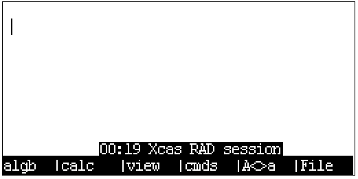
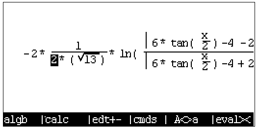

# [ExistOS-For-HP39GII](https://github.com/Repeerc/LibreCalc-For-HP39GII)

[中文自述文件](./README.md)

An open source HP39GII firmware project

## Project overview

[](https://opensource.org/licenses/GPL-3.0/)
[](https://github.com/ExistOS-Team/ExistOS-For-HP39GII/actions/workflows/build.yml)

This firmware project is created by a group of calculator enthusiasts, using libraries such as [FreeRTOS kernel](https://github.com/FreeRTOS/FreeRTOS), [TinyUSB](https://github.com/hathach/tinyusb), [FatFs](http://elm-chan.org/fsw/ff/00index_e.html), [dhara](https://github.com/dlbeer/dhara), etc. Like-minded friends are more than welcome to try out and improve the code of this project. We'd love to hear your comments!

## Contents

- [ExistOS-For-HP39GII](#existos-for-hp39gii)
  - [Project overview](#project-overview)
  - [Contents](#contents)
  - [Current development status](#current-development-status)
	- [Experimental features](#experimental-features)
  - [Compiling](#compiling)
    - [Prerequisites](#prerequisites)
      - [Windows](#windows)
      - [Linux](#linux)
        - [Add udev rules](#add-udev-rules)
        - [Compiling sbtool](#compiling-sbtool)
    - [Compiling ExistOS](#compiling-existos)
  - [Installing firmware (Currently only works under Windows)](#installing-firmware-currently-only-works-under-windows)
    - [Flashing OSLoader](#flashing-osloader)
      - [Manual flashing](#manual-flashing)
      - [Flashing with automated tools](#flashing-with-automated-tools)
  - [Basic usage of firmware](#basic-usage-of-firmware)
    - [Booting for the first time](#booting-for-the-first-time)
    - [Accessing internal storage](#accessing-internal-storage)
    - [Basic usage of KhiCAS](#basic-usage-of-khicas)
      - [Basic calculations](#basic-calculations)
      - [Example 1: Plotting](#example-1-plotting)
      - [Example 2: Indefinite integrals](#example-2-indefinite-integrals)
      - [Example 3: Definite integrals](#example-3-definite-integrals)
      - [Example 4: Programming to draw Feigenbaum bifurcation diagrams mapped with Logistic equations](#example-4-programming-to-draw-feigenbaum-bifurcation-diagrams-mapped-with-logistic-equations)
  - [Uninstalling ExistOS and flashing back to stock system](#uninstalling-existos-and-flashing-back-to-stock-system)
  - [Code submision standard](#code-submission-standard)
  - [Contributors](#contributors)
  - [License](#license)


## Current development status
- [x] Boot
- [x] Serial debugging
- [x] LCD driver supporting 256 shades of grey
- [x] STMP3770 interrupt controller
- [x] Keyboard driver (GPIO polling)
- [x] Timer driver
- [x] Setting CPU frequency
- [ ] Real-time clock
- [x] USB mass storage device mode
- [x] USB serial console
- [x] USB keyboard & mouse emulation
- [x] USB functions dynamic configuration
- [x] Flash driver
- [x] FATFS implementation
- [x] Multitasking
- [x] Virtual memory
- [ ] Loading applications
- [x] Miminal MicroPython implementation
- [x] Graphical user interface
- [x] Basic power management
- [ ] Complete power management
- [x] Firmware updating independent of stock tools

### Experimental features

- [x] Charging Ni-Mh batteries in the compartment via USB power


Current development status is as described above. User interface etc. are still under discussion. You may open an issue to give your opinion.


## Compiling

- If you just want to try out the system instead of compiling it yourself, binaries are available at [Release](https://github.com/ExistOS-Team/ExistOS-For-HP39GII/releases). Then jump to [Flashing with automated tools](#flashing-with-automated-tools) section for instructions.

### Prerequisites

You need to install `gcc-arm-none-eabi` first.
- For Windows, please download from [here](https://developer.arm.com/downloads/-/gnu-rm).
  - Please note that you'll need to add the path to `bin` folder under the installation directory to the environment variable `Path`.
- For Linux, differences exist between distros.
  - Debian/Ubuntu or other distros using `apt` package manager
    ```bash
    sudo apt-get install gcc-arm-none-eabi -y
    ```
  - Arch or other distros using `pacman` package manager
    ```bash
    sudo pacman -Syu arm-none-eabi-gcc
    ```
- For other operating systems or Linux distros without corresponding packages
  - Download source code from [here](https://developer.arm.com/tools-and-software/open-source-software/developer-tools/gnu-toolchain/downloads) and compile.

#### Windows

Please download [Ninja](https://github.com/ninja-build/ninja/releases) and extract it. Then add its path to the environment variable 'Path'.

#### Linux

###### Add udev rules

For Linux, to allow HP39GII to be detected by udev, you need to copy `99-hp39gii.rules` to  `/etc/udev/rules.d/`.
```bash
sudo cp 99-hp39gii.rules /etc/udev/rules.d/
```

Then restart `udev`.
```bash
sudo service udev restart
```

In case it doesn't work:
```bash
sudo udevadm control --reload-rules
sudo udevadm trigger
```

##### Compiling sbtool

This tool for Windows has been compiled in advance, but you need to compile it if you use Linux.

Enter `tools/sbtools` and execute command `make`. You might need to install the libraries below.
- libusb(1.0)
- libcrypto++
  - Installation tutorial is in [Crypto++ Wiki](https://cryptopp.com/wiki/Linux#Distribution_Package)

- For Ubuntu, please install libraries according to the Action configurations of this project
  ```bash
  sudo apt-get install libcrypto++6 libcrypto++-dev libusb-1.0-0-dev -y
  ```
- Arch
  ```bash
  sudo pacman -Syu libusb crypto++
  ````

If `pkg-config` cannot find libcrypto++ or other libraries, please ensure that there are `.pc` files of the library under `/usr/lib/pkgconfig/`, which is necessary for it to be detected by `pkg-config`.

If the files exist, please modify Makefile. Otherwise, you may need to reinstall the library or modify the pkg-config command in Makefile.

Then enter `Libs/src/micropython-master/ports/eoslib` and execute command `make`.
```bash
cd Libs/src/micropython-master/ports/eoslib
make
```

### Compiling ExistOS

Create a new directory to store binary files and cache
```bash
mkdir build
cd build
```

Preparing to compile
  - Linux
    ```bash
    cmake ..
    ```
  - Windows
    ```bash
    cmake .. -G Ninja
    ```

Compiling
  - Linux
    ```bash
    make
    ```
  - Windows
    ```bash
    ninja
    ```

## Installing firmware (Currently only works under Windows)

### Flashing OSLoader

Note: Please install drivers for HP39GII yourself.

OSLoader boots ExistOS and provides low-level API and virtual memory functionalities. Run commands below to load OSLoader into the calculator's RAM. (Calculator is required to be in flashing mode.)

Before flashing, please power off your calculator completely by removing the batteries, then plug in USB cable while holding down the `ON/C` key. Your calculator will then enter flashing mode.

You can see if an HID device named "USB Input Device" with the ID of 066F:3770 shows up in Device Manager under Windows.


#### Manual flashing

First, use sbtool to load OSLoader into the calculator's RAM:
```bash
ninja sb_flash
```
After OSLoader has been running, the calculator will display the following screen saying "Could not find the System":


Right now OSLoader is only running off RAM, proceed to execute following commands to flash OSLoader to the boot sector on the flash of the calculator:
```bash
ninja edb_flash_loader
```
The calculator will then reboot automatically, but no system will be found. Lastly the following commands are required to flash the system onto the flash:
```bash
ninja edb_flash_sys
```
After the process finishes the calculator will reboot automatically and run normally. If it does not respond for an extended period of time, please try flashing from the beginning.

#### Flashing with automated tools

[ExistOS Updater](https://github.com/ExistOS-Team/ExistOS_Updater_v2/releases) (available on Windows 10 and newer versions) can be used to flash OSLoader and System.

For devices that doesn't have OSLoader (e.g. devices with stock firmware), please turn off the calculator completely, then connect it to computer while holding down `ON/C` key. Click `Refresh` button on the updater. If the status bar says `Device Connected [HostLink Mode]`, OSLoader and System images can be selected, then flashed onto the device by clicking `Update OSLoader & System`.

For devices that already has OSLoader installed, you'll only need to turn on the device, connect it to computer, click `Refresh` button, wait for the status bar to show `Device Connected [Bin Mode EDB]` and proceed to flash.

Or you can try to install stock tools and use Firmware Updater to flash OSLoader by renaming `OSLoader.sb` to `firmware.sb` and replacing the stock file with it.

## Basic usage of firmware

### Booting for the first time

After booting and flashing, the first time the system boots you'll see the following dialog, prompting you to format the data section of the flash as FAT16. Press `ENTER` to confirm the operation. It usually takes around 30 seconds.


This screen indicates a successful format. Select OK to enter the main menu.


The system only comes with a KhiCAS application for now. Press `←` `→` `↑` `↓` to navigate, `ENTER` to confirm.


The Status tab currently shows the system status.


`ON` + `F6` Force reboot  
`ON` + `F5` Enter formatting interface

### Accessing internal storage

Holding down `F2` while booting (or immediately after pressing `ON/C`) will bring up the following interface:


A 80 MB USB drive will then show up on the computer, which is the data section of the onboard flash. `System` directory stores assets e.g. fonts and pictures which are unused right now. `xcas` directory stores KhiCAS user scripts, sessions (history) and other information.


### Basic usage of KhiCAS

Press `↓` to select the KhiCAS app under the Application tab in the main menu, and press `ENTER` to launch. A dialog will show up on the first launch for you to choose between Xcas mode `F1` and Python mode `F6`.


After configuration, the current state is shown on the status bar below. The first item is current time, the second is mode (Xcas or Python), the third is the filename of the current session.

Note: RTC interface is not ported for now, thus time might be shown incorrectly.



Calculations may be performed after initialization.

Long press `ON/C` to clear history.

Press `SHIFT` then long press `ON/C` to save session and shutdown.

#### Basic calculations

General expressions can be entered in KhiCAS to perform calculations. Calculation of large integers is supported, however for floating point calculation, only single-percision floating point numbers are supported.


For an expression entered in linear mode, select View (`F3`) to edit it in the natural textbook editor.


Press `F1` and `F2` to bring up *could-be* commonly-used commands menu.


`cmds` menu (`F4`) lists all available commands in KhiCAS as nested entries, including algebraic, complex, polynominal, probability, plotting, etc., where you can search commands needed. After selecting the command, press `Input` to copy to the main menu, `ex1` `ex2` to copy built-in examples or `help` to show built-in help.


#### Example 1: Plotting

Use `plot` command to plot functions. In the plot interface: Press `↑` `↓` `←` `→` to move the canvas, `+``-` to zoom, `*` to auto-zoom and fill the screen, `/` to auto-zoom and keep the scale of the axes equal.

```
  plot(expression, x)
  plot(expression, x=[start...end], xstep=step)
```


`plotpolar` command plots in polar coordinate system.


`plotfield` command draws vector fields.


#### Example 2: Indefinite integrals





#### Example 3: Definite integrals


#### Example 4: Programming to draw Feigenbaum bifurcation diagrams mapped with Logistic equations

*(what)*

Two input syntax modes are present in KhiCAS, namely Xcas and Python. With the ability to execute scripts, new functions can be defined via programming. Here we use Python syntax to implement the following bifurcation diagram.


Press `File` (F6) in the main menu and select the 6th item to open the script editor.


In the editor, the top left corner shows current time, syntax mode, filename and current line/total lines. `F1`~`F3` stores shortcut commands such as symbolic conditionals, loop bodies, function definitions, etc.


The script we are using is as follows. First we define two global vectors `r` and `p`, where the result of function `f` iteration will be stored. Then we can plot by calling KhiCAS command `point(r,p)` externally.

```python
r = []
p = []
def f():
  for u in range(0, 40):
    x = 0.132456
    for n in range(1,50):
      x1 = (u/10)*x*(1-x)
      x = x1
      if n > 25:
        r.append(u/100)
        p.append(x)
  return
```

After editing, the script can be checked and compiled using the Check syntax option in the File menu, and the result will be output to the console.


The following figure shows the result of compiling a script with a symbolic error, with a specific indication of the line number. (Compiling Python scripts in Xcas mode also causes error.)


The result of a successful compilation is shown below.


The function name in the script is called to execute the function written above, and the `point` command is then called to draw the scattered data to the canvas.


Final output:


Note:

Since the giac algebra system is relatively large (about 3MB) and the calculator has only about 300KB of physical memory, the virtual memory on the flash is used here to fill the gap. For example, in drawing the bifurcation diagram above, the Python script iterates internally about 2000 times, and the final result occupies about 90KB of memory, but eventually takes up to 340 seconds, triggering a total of 440,000 memory swaps and generating about 3 full flash P/E cycles.

## Uninstalling ExistOS and flashing back to stock system

You need to erase the whole flash before flashing back to the stock system, otherwise you'll get stuck at the formatting procedure when using the stock flashing tool.

How to erase the whole flash:  
After flashing OSLoader or while ExistOS is running, press `ON`+`F5` to enter the data clearing interface, then press `SYMB` to enter the full disk erase interface and pressing `F1` will confirm the operation. This cannot be undone. When the screen shows "Operation Finish", power cycle the calculator and launch the stock flash tool under Windows 7/XP to flash back to the stock system.

## Code submission standard

**If you want to contibute code, please follow these standards**

1. Variable

    * Variables are named using lower camel case. For example, `windowHeight`
    * Function parameter naming is the same as variable.
    * Don't name using a single letter except for temporary or loop variable. 
    * It is prefered to add some meaningful prefix. For example, `p` means pointer.
    * Don't define variable and pointer at the same time on one line, such as `char *p, q;`

2. Function

    * Functions are named using underline. For example, `get_window_width`。
    * Function names should follow the Verb - object relationship.
    * It is prefered to add some meaningful prefix. For example, `is` means the type of return value is bool.
    * Short function can be defined as inline, function parameters and return values should be pointer instead of variable.
    * Avoid using recursion, consider refactoring to cycling.

3. Constant, macro and hardware-related

    * Constants and macros are named using underline to divide upper-case letters. For example, `MAX_WIDTH`。

4. Custom type

    * Custom type names are named using underline (tentative).
    * Must use typedef to define a custom type before using struct to define non-single-instance object.

5. Operator and other symbol

    * Unary operators should appress the variable, such as `c++`, `*p`.
    * Binary operators shold have spaces on both sides, such as `i == 1`, `a += 3`, except for `->`
    * Ternary are the same as binary, such as `isLeft ? 1 : 0`.
    * commas should be followed by a space.
    * Parentheses should be added appropriately where it is not easy to understand.

6. Pseudo-class

    If object-oriented is necessary, you can consider using `typedef struct` as pseudo-class.

    * Pseudo classes should be named by the upper camel case (Pascal) name.

    * For properties inside the class, its name is the same as the general variable.

    * Pseudo-class methods are not saved in pseudo-classes, but are global functions. Methods should be named using underline.

      * Normal method should be named as `ClassName_method_name`, the first parameter should always be a pointer to the instance and be named `this` (even unnecessary).

      * Static method should be named as`ClassName_static_method_name`。
      * General method named `ClassName_initializer` should be called right after an instance is defined.

7. Coding

    7.1

    ```c
    if (a == 1) {                          // There should be spaces between keywords and brackets, and spaces between brackets and curly brackets
        // code here
    }else{                                 // Use Java style
        // code here
    }
    if (b == 1) return;                    // When there is only one sentence of code in the block, you can leave a blank space without curly braces
    ```

    7.2

    ```c
    while (true)
        ;                                  // When using empty loops, you should wrap the semicolon and indent it
    ```
    7.3

    ​	(a) The loop variable of a general for loop is defined in the for loop:

    ```c
        for (int i = 0; i < l; i++) {
            // code here
        }
    ```

    ​	(b) In cases where circular variables are used externally, an initial value should also be given here:

    ```c
        int i;
        for (i = 0; i < l; i++) {
                // code here
        }
        return i;
    ```

    ​	(c) Do not leave any of the three of for loops empty: ` for ( ; ; ) `, otherwise use the while loop.

    7.4 Don't use assignment where a sentence needs to be judged, such as `if (a = 1), (a = 1) ? a : 0 `.

    7.5 The goto statement should be avoided as much as possible.

    7.6 Switch should be used more than else if.In a switch statement, it is best to have a break/return statement in each case, except when multiple cases share exactly the same piece of code.Care should be taken when using switch traversal and it is best to comment on it.

For VSCode users, `clang-format` extension is available to format the code conveniently.

## Contributors


## License

[GPL-3.0](https://github.com/Repeerc/LibreCalc-For-HP39GII/blob/master/LICENSE)
